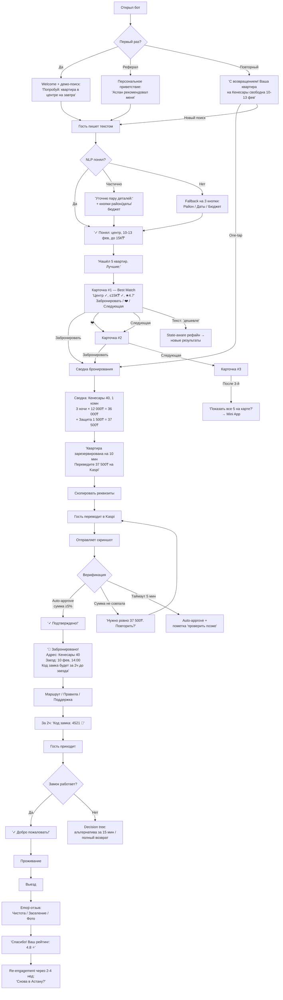
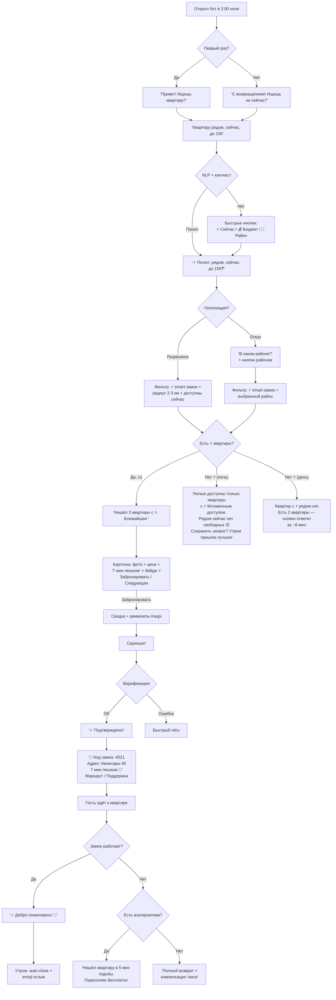
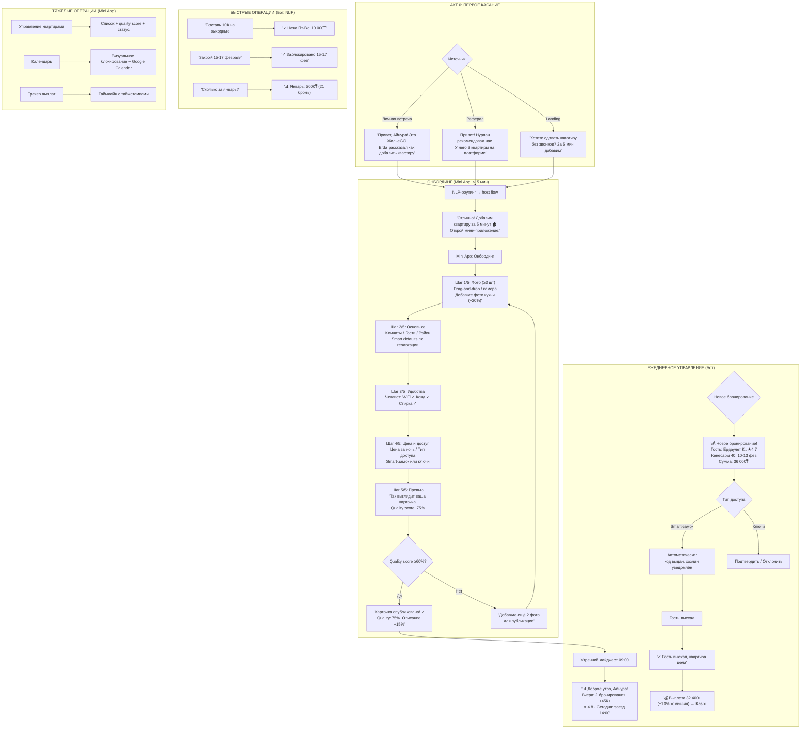
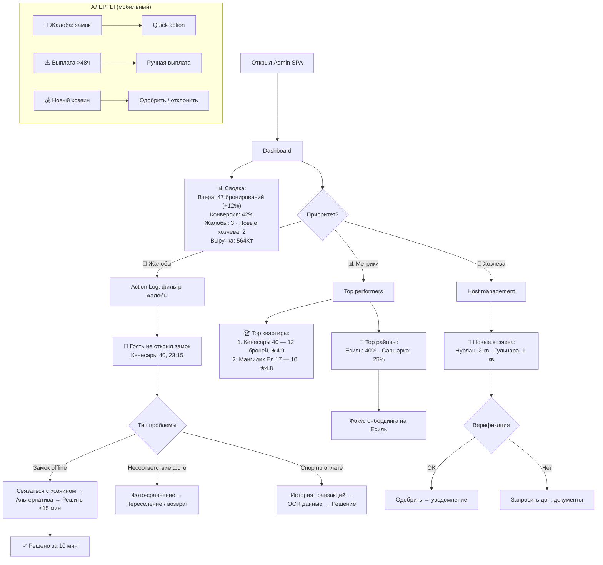
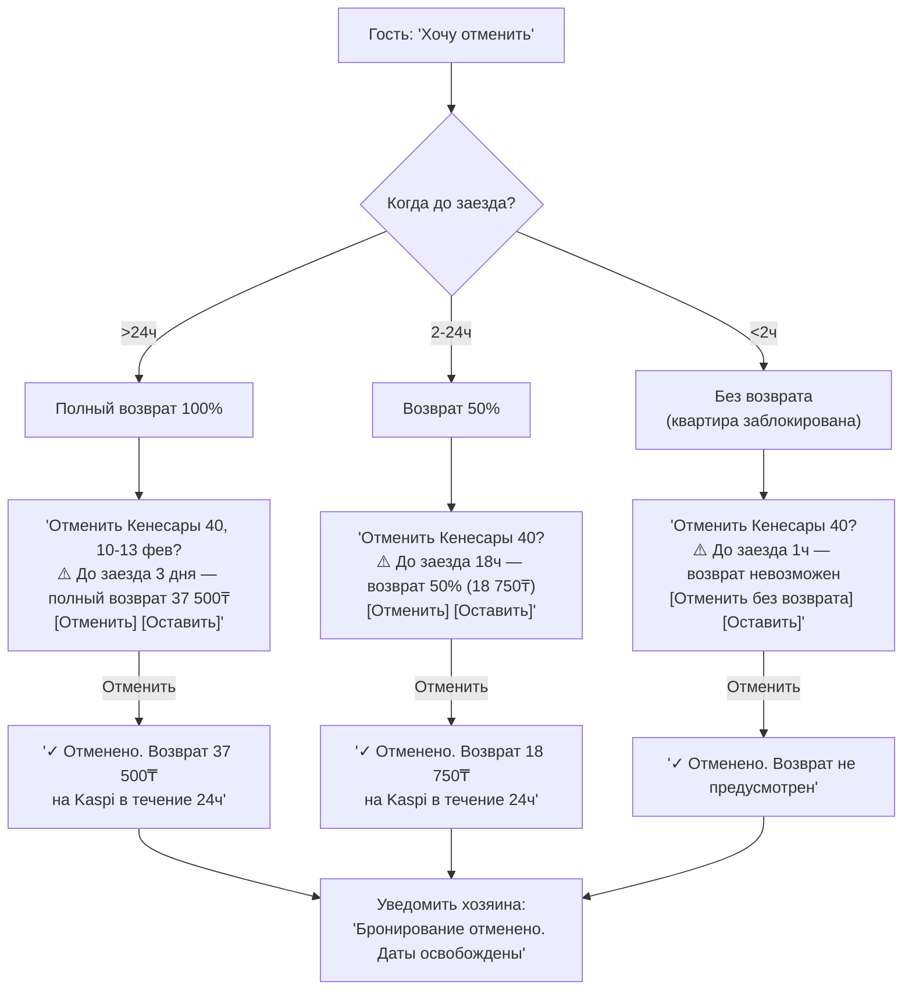

# UX Design Specification rental-pro-jgokz

**Author:** Erda
**Date:** 2026-02-04

---

## Executive Summary

### Project Vision

ЖильеGO — Telegram-native маркетплейс посуточной аренды квартир в Казахстане. Продукт решает критическую проблему: невозможность быстро снять квартиру без звонков и долгих переговоров, особенно в ночное время.

Гость описывает потребность на естественном языке в Telegram (текстом или голосом), бот подбирает квартиру, принимает оплату и выдаёт код smart-замка — без звонков, без встреч, без скачивания приложения, без регистрации. Хозяин получает деньги автоматически, не просыпаясь ради гостей.

**Ключевое обещание:** Надёжное заселение без единого звонка. Быстро — за 5 минут. Предсказуемо — квартира как на фото, код работает, деньги приходят. А если что-то пошло не так — бот решает проблему, а не регистрирует жалобу.

**Три дифференциатора:**
- **Conversational-First UX** — NLP-поиск текстом и голосом вместо форм и фильтров. Для повторных гостей: "как в прошлый раз" — бронирование за 30 секунд
- **Мгновенный доступ (⚡)** — квартиры со smart-замком получают бейдж, приоритет в выдаче, работают ночью. Не отдельный "mode", а свойство квартиры, которое масштабируется с ростом supply
- **Telegram-Native** — полноценный маркетплейс внутри мессенджера. Telegram = аккаунт (zero-friction вход). Mini App для rich-контента, бот для диалога и действий

**Платформы:** Telegram-бот (гости + хозяева) + Mini App (rich-контент) + Admin SPA + Landing (Next.js)
**География MVP:** Астана. Расширение: Алматы, Шымкент (12 мес).
**Бизнес-модель:** 10% комиссия + сбор за защиту (500-1500 ₸).

### Target Users

**MVP-пользователи:**

| Роль | Персона | Контекст использования | Устройство | Ключевая потребность |
|------|---------|----------------------|------------|---------------------|
| **Гость (плановый)** | Ердаулет, 32, командировочный. Летает 2-4 раза/мес | Бронирует за 1-7 дней. 80% повторных — "как в прошлый раз". Нужно подтверждение для бухгалтерии | Мобильный (Telegram) | Предсказуемость и подтверждение |
| **Гость (экстренный)** | Аслан, 27. Квартира прямо сейчас, ночью, рядом | Фильтр "⚡ Мгновенный доступ" + геолокация. Если smart-замков мало — бот честно показывает доступное количество | Мобильный (Telegram) | Скорость и минимум действий |
| **Хозяин квартир** | Айнура, 45, 3 квартиры. Устала от звонков, боится незнакомцев | Бот: утренний дайджест + алерты. Mini App: фото, управление, трекер выплат. Хочет видеть гостя и иметь право отклонить | Мобильный (Telegram + Mini App) | Пассивный доход + контроль |
| **Админ (founder)** | Erda. 200 квартир, 50 бронирований/день | Real-time дашборд + алерты. Критические действия с телефона | Десктоп (Admin SPA) + мобильный | Real-time видимость |

**Growth-пользователи:** корпоративные заказчики, агентства недвижимости.

**Техническая грамотность:**
- Гости: средняя. Telegram, Kaspi, 2GIS — знакомые. Пишут со сленгом, опечатками, рус/каз микс
- Хозяева: средняя-низкая. Онбординг через Mini App, не бот. Первые 15 — личные встречи
- Админ: высокая (founder-разработчик)

### Key Design Challenges

1. **Conversational UX: от первого сообщения до пустой витрины** — NLP должен понимать текст и голос, сленг ("хата", "однушка"), опечатки, рус/каз микс. При неудаче — плавный переход на кнопки без ощущения ошибки ("Уточню пару деталей:" вместо "Не понял"). Критически важен **guided first experience**: не просто примеры текста, а интерактивное первое бронирование. Первый экран: "👋 Попробуй написать: 'Квартира в центре на завтра, до 15000₸' [или нажми кнопку ниже]" → пользователь пишет → бот показывает как понял → "Отлично! Теперь выбери квартиру..." → step-by-step с подсказками до завершения. При малом supply (50 квартир на старте): умное ослабление фильтров ("Не нашёл точно, но есть похожее за 17000₸ в 10 мин"), честное "Сейчас 2 квартиры в этом районе. Расширить?", waitlist при нулевом результате. **Метрика успеха: first message success rate ≥50%** (если ниже — NLP провалился, нужен редизайн onboarding)

2. **Двустороннее доверие с нуля** — рынок КЗ страдает от мошенничества (Krisha.kz удаляет ~3000 фейков/мес). UX должен транслировать безопасность для обеих сторон:
   - **Для гостей:** верификация квартир, бейджи "Проверено" и "⚡", отзывы, гарантия заселения (переселение/возврат), прозрачность оплаты
   - **Для хозяев:** рейтинг гостя перед заселением, право отклонить бронирование, прозрачность защиты от ущерба, трекер выплат с таймстампами, "мягкая" обработка первого негативного отзыва

3. **Три интерфейса, три роли: бот vs Mini App vs Admin SPA** — чёткое разделение:
   - **Бот (гости):** диалог, поиск, бронирование, оплата, получение кода, уведомления. Core flow — полностью в боте. Превью карточки: 1 фото + цена + рейтинг + "Забронировать" / "Подробнее"
   - **Mini App (гости):** "Подробнее" → галерея фото, карта с маршрутом, отзывы. Просмотр — в Mini App, оплата — всегда возвращается в бот (один payment flow)
   - **Бот (хозяева):** утренний дайджест ("Вчера: 2 бронирования, +45К₸, ⭐4.8. Сегодня: заезд 14:00") + критичные алерты + быстрые действия (подтвердить/отклонить). Категоризация: 💰📅⭐🚨
   - **Mini App (хозяева):** онбординг (drag-and-drop фото, описание), управление квартирами, календарь, трекер выплат. **Метрика успеха: host onboarding time ≤15 мин** (если больше — упростить flow)
   - **Admin SPA:** полное управление на десктопе, критические действия (жалобы, блокировки, выплаты) — адаптивно на мобильном

4. **Гибридная оплата MVP** — Kaspi-перевод как стартовый метод: улучшение через автокопирование реквизитов в буфер обмена. Deep link Kaspi с предзаполнением (красиво, но требует прямой интеграции с Kaspi — 2-3 месяца согласований, NDA, минимальные объёмы) — не MVP. Критичное противоречие: booking hold (10 мин) < верификация скрина (до 15 мин) — hold автоматически продлевается после отправки скрина. Обязательный прогресс-индикатор: "✓ Скриншот получен → Проверяем → ✓ Подтверждено!". Явное: "Квартира зарезервирована за вами на время проверки". При отклонении — причина (сумма/дата/получатель) + предзаполненная повторная оплата. **Метрика успеха: booking completion rate ≥40%** (from search to payment). Приоритетный переход на агрегатор (PayBox/Wooppay)

5. **Graceful Degradation UX** — каждый процесс может сломаться. UX для unhappy path так же важен, как для happy path. **Decision trees для каждого failure mode:**
   - **Замок офлайн:** проверить статус ДО выдачи кода → если офлайн → искать альтернативы в радиусе 1км → если есть → предложить переселение → если нет → полный возврат + компенсация такси
   - **Скриншот отклонён:** показать причину (сумма не совпадает / дата старая / получатель неверный) → автопредзаполнить корректные реквизиты → retry
   - **Выплата задерживается >24ч:** автосообщение хозяину ("банковский процессинг, ETA: завтра") → если >48ч → escalate to Erda с push-алертом
   - **Прогресс-индикаторы:** для всех асинхронных процессов — пользователь видит этап с таймстампами
   - **Метрика успеха: critical issue resolution time ≤15 мин** (если больше — graceful degradation не работает)

6. **Smart-замок как свойство, не mode** — в MVP smart-замок = бейдж "⚡ Мгновенный доступ" + приоритет в выдаче + ночной фильтр. Не отдельный "on-demand mode" с двумя flow. Это упрощает UX: один поисковый flow, квартиры с ⚡ показываются первыми. On-demand как отдельный UX-слой — после 30%+ квартир с smart-замками. В админке: "On-demand ready: 7/50 (14%). Цель: 30%"

### Design Opportunities

1. **"Квартира за 60 секунд" → "как в прошлый раз"** — для новых: NLP + бейдж ⚡ + быстрая оплата = рекордный UX (конкуренты — 15-30 мин + звонки). Для повторных: бот строит автопрофиль из истории (район, цена, тип), предлагает "ту же квартиру" или аналог. **Защита от копирования:** NLP для рус/каз микса + сленга требует dataset и fine-tuning (3-6 месяцев). Автопрофиль работает только с накопленными данными — switching cost. **Метрика успеха: retention 25% за 90 дней** (повторные бронирования через автопрофиль)

2. **Доверие через UX-паттерны** — бейджи "Проверено" и "⚡ Мгновенный доступ", гарантия заселения ("переселение за 15 мин или полный возврат"), прозрачная детализация оплаты и трекер выплат, видимый рейтинг гостя для хозяев. **Защита:** верификационная инфраструктура (паспорта, документы, фото-проверка) — не template, требует compliance и операционную экспертизу. **Метрика успеха: NPS ≥50 для MVP, ≥60 для 12 мес**

3. **Problem-Solving Bot** — бот решает проблемы, а не регистрирует: альтернативная квартира при проблеме с доступом, возврат при несоответствии фото, продление hold при задержке, трекер выплат. **Защита:** orchestration logic с decision trees и fallback chains — не просто FAQ, требует product engineering. Дифференциатор: Krisha.kz и Airbnb = "ждите ответа", ЖильеGO = мгновенное решение. **Метрика успеха: автоматическое разрешение ≥70% проблем без эскалации**

4. **Telegram Mini App как rich-слой** — карточка квартиры (галерея + карта + отзывы), онбординг хозяев (drag-and-drop фото), трекер выплат, календарь. Всё внутри Telegram, без выхода. **Защита:** кастомная разработка под Telegram WebView constraints (no native drag-and-drop iOS, ~50MB memory limit) — не template. **Метрика успеха: host onboarding time ≤15 мин через Mini App vs 40 мин через бота**

5. **Lifecycle-коммуникация** — бот не замолкает после бронирования. Post-booking: рост рейтинга + подсказка "как в прошлый раз". Re-engagement: "Снова в Астану? Ваша квартира свободна". "Горячие предложения" хозяевам для пустых ночей. Видимая ценность аккаунта (рейтинг, история, доступ к ТОП-квартирам). **Защита:** персонализация на основе поведенческих данных — недоступна без накопленной истории. **Метрика успеха: trigger-based re-engagement конверсия ≥15%**

6. **Zero-friction вход** — Telegram = аккаунт (имя, телефон уже есть). Нет регистрации, нет формы, нет пароля. При первом бронировании — только IIN. **Защита:** техническая простота = конкурентное преимущество (конкуренты тратят месяцы на auth flows). **Метрика успеха: time to first search ≤30 секунд от открытия бота**

### UX Prioritization

**Must-Have MVP** — без этого продукт не работает (6-8 недель разработки):

**Implementation Sequence:**
- **Week 1-2:** Telegram bot basic flow (NLP text search + aggressive fallback на кнопки, guided first experience с интерактивным туториалом, zero-friction auth через Telegram)
- **Week 3-4:** Mini App карточка квартиры (галерея фото + карта + описание + отзывы), превью в боте с кнопками "Забронировать" / "Подробнее"
- **Week 5-6:** Mini App онбординг хозяев (загрузка фото, описание, базовое управление), бот-дайджест для хозяев
- **Week 7-8:** Payment flow в боте (Kaspi-перевод с автокопированием, прогресс-индикаторы, продление hold), graceful degradation (decision trees для failure modes), базовые trust-элементы (бейджи "Проверено" и "⚡")

**Компоненты:**
- NLP текстовый поиск + aggressive fallback на кнопки
- Guided first experience (интерактивный туториал первого бронирования)
- Превью карточки в боте (1 фото + цена + рейтинг + кнопки)
- Mini App карточка квартиры (галерея + описание + отзывы)
- Mini App онбординг хозяев (загрузка фото, описание)
- Telegram = аккаунт (zero-friction вход, IIN при первом бронировании)
- Базовые trust-элементы (бейдж "Проверено", бейдж "⚡", рейтинг, гарантия заселения)
- Прогресс-индикаторы (оплата, бронирование)
- Умное ослабление фильтров (cold start: "не нашёл точно, но есть похожее")
- Graceful degradation с decision trees (fallback при проблеме с замком, продление hold при верификации, авторазрешение проблем)
- Оплата в боте (один payment flow), Kaspi-перевод с автокопированием

**Technical Constraints:**
- NLP: использование готовой модели (OpenAI/Claude API), не custom training — MVP-feasible
- Mini App: Telegram WebView constraints (no native drag-and-drop iOS, limited geolocation, ~50MB memory limit) — требует workarounds
- Kaspi deep link: НЕТ публичного API, требует прямой интеграции (2-3 мес, NDA, min объёмы) — NOT MVP, fallback = автокопирование
- Smart-замки: интеграция через TTLock API — documented, achievable

**Should-Have (первые 4-8 недель после запуска):**
- Утренний дайджест для хозяев ("Вчера: 2 бронирования, +45К₸")
- Категоризация уведомлений (💰📅⭐🚨)
- Трекер выплат с визуальным таймлайном в Mini App
- Problem-solving bot с расширенными decision trees
- "Как в прошлый раз" (после появления повторных гостей)
- Проактивные уведомления при задержках (>24ч выплата, >48ч escalate)
- Платёжный агрегатор (PayBox/Wooppay) — приоритет для on-demand UX

**Technical Constraints:**
- Агрегатор: интеграция 2-4 недели, fee 2.5-3.5%, но instant confirmation — критично для on-demand

**Nice-to-Have (после 100+ бронирований, когда есть данные):**
- Голосовой поиск (voice messages → speech-to-text → NLP)
- Swipe-интерфейс в Mini App (кастомный UI-компонент)
- Автопрофиль предпочтений из истории (3+ бронирований для dataset)
- "Квартира ищет гостя" (персональные push на основе профиля)
- "Горячие предложения" для пустых ночей хозяев (dynamic pricing logic)
- Gamification для хозяев ("Топ-10 по району")
- "Живой" статус карточки ("5 человек смотрят")
- Trigger-based re-engagement (поведенческая аналитика)
- On-demand как отдельный UX-слой (после 30%+ smart-замков)

**Technical Constraints:**
- Голосовой поиск: speech-to-text API latency 2-5 сек — приемлемо, но не critical path
- Персонализация: требует аналитический pipeline (tracking, segmentation, triggering)

---

## Core User Experience

### Defining Experience

**Ядро продукта: Conversational-поиск квартиры**

Самое важное взаимодействие в ЖильеGO — момент, когда гость описывает потребность на естественном языке, а бот подбирает квартиру. Это ключевой дифференциатор от конкурентов (Krisha.kz, Airbnb), где требуются формы, фильтры и звонки.

Core loop гостя: **Описал → Выбрал → Оплатил → Заселился** — без единого звонка, без регистрации, без скачивания приложения.

Core loop хозяина: **Добавил квартиру → Получил бронирования → Получил деньги** — минимум ручного труда, максимум автоматизации.

### Platform Strategy

**MVP (Phase 1):**

| Платформа | Роль | Для кого |
|-----------|------|----------|
| **Telegram Bot** | Основной интерфейс: conversational UX, поиск, бронирование, оплата, код доступа, уведомления | Гости + Хозяева |
| **Telegram Mini App** | Rich-слой: галерея фото, карта, отзывы, онбординг хозяев (загрузка фото, описание). **Только Telegram** — не доступен в других мессенджерах | Гости (просмотр) + Хозяева (управление) |
| **Admin SPA** | Полное управление платформой (desktop-first, адаптив для критических действий на мобильном) | Админ (founder) |
| **Landing** | Привлечение через QR-коды, SEO, конверсия в Telegram-бот | Все |

**Phase 2 (Growth):**

| Платформа | Роль | Для кого |
|-----------|------|----------|
| **WhatsApp Bot** | Второй канал для гостей/хозяев (только бот, rich-контент через **веб-ссылки на отдельный веб-сайт**, не Mini App) | Гости + Хозяева |

**Архитектурное следствие:** Rich-контент (карточка квартиры, галерея, отзывы) должен проектироваться как **отдельный веб-компонент**, который в Telegram открывается как Mini App, а в WhatsApp — как веб-ссылка. Два разных способа отображения, один источник данных.

**Device Context:**
- Основное устройство: мобильный Telegram (touch-based, 90%+ трафика)
- Desktop: админка + landing
- Offline: не критично (требуется интернет для всех операций)
- Device capabilities: геолокация (on-demand поиск), камера (скриншоты оплаты)

### Effortless Interactions

#### MVP — без усилий с первого дня

1. **Zero-friction вход** — Telegram = аккаунт. Имя и телефон уже есть. Нет регистрации, нет формы, нет пароля. IIN — только при первом бронировании
2. **NLP текстовый поиск с fallback на кнопки** — гость пишет текстом → бот понимает → показывает результаты. Если не понял — бесшовный переход на кнопки ("Уточню пару деталей:" вместо "Не понял"). Пользователь чувствует помощь, а не ошибку
3. **Автокопирование реквизитов Kaspi** — одна кнопка → номер и сумма скопированы → перешёл в Kaspi → оплатил → вернулся → отправил скриншот
4. **Автоматическая выдача кода замка** — оплата подтверждена → код доступа мгновенно в чате. Без ожидания, без звонков хозяину (для квартир с ⚡ Мгновенным доступом)
5. **Guided first experience** — первый контакт с ботом: приветствие → пример запроса → интерактивный туториал первого бронирования. Не пустой чат, а пошаговое ведение за руку

#### Growth — без усилий по мере развития

6. **Голосовой поиск с каскадным fallback** — голос → speech-to-text → NLP → если не понял, переход на текст → если не понял текст, fallback на кнопки. Полный каскад без ощущения ошибки (требует speech-to-text pipeline)
7. **"Как в прошлый раз"** — для повторных гостей (3+ бронирования): бот помнит предпочтения (район, цена, тип), предлагает "ту же квартиру" или аналог. Бронирование за 30 секунд (требует накопленных данных)
8. **Автоматизация уборки** — платформа организует уборку между гостями, хозяин не думает об этом (требует маркетплейс услуг — Future Vision)

### Critical Success Moments

**Гость — make-or-break:**

| Момент | Успех | Провал | Fallback | SLA (из PRD) |
|--------|-------|--------|----------|------|
| **Первый контакт (onboarding)** | Бот приветствует, показывает пример, ведёт через первый поиск → пользователь понимает как работает | Пустой чат, пользователь не знает что делать | Welcome-сценарий с интерактивным туториалом и кнопками быстрого старта | Time to first search ≤30 сек |
| **Первый NLP-запрос** | Бот понял текст с первого раза, показал релевантные квартиры | Бот не понял текст | Бесшовный fallback на кнопки: "Уточню пару деталей:" | First message success rate ≥50% |
| **Заселение по коду** | Код работает, квартира как на фото → доверие установлено. **THE moment** | Код не работает / квартира не соответствует | Альтернатива в радиусе 1км за 15 мин или полный возврат | Successful check-in rate ≥95% |
| **Повторное бронирование** | Быстрое бронирование, знакомый flow → retention | Долгий процесс, нет памяти о предпочтениях | Стандартный flow поиска (всё ещё быстрее конкурентов) | Retention ≥25% за 90 дней |

**Хозяин — make-or-break:**

| Момент | Успех | Провал | Fallback | SLA (из PRD) |
|--------|-------|--------|----------|------|
| **Onboarding (Mini App)** | Квартира добавлена за ≤15 мин: фото, описание, цена, настройки | Процесс долгий, непонятный, бросает на полпути | Личная помощь (первые 15 хозяев), видео-инструкция + созвон (16-50) | Host onboarding time ≤15 мин |
| **Выезд гостя без инцидентов** | Гость выехал → нет повреждений → хозяин счастлив | Повреждения, жалобы | Сбор за защиту покрывает ущерб, фото → платформа решает | Damage-free rate ≥98% |
| **Получение выплаты** | Деньги пришли автоматически после выезда | Задержка >24ч | Автосообщение хозяину с ETA, >48ч → эскалация на founder | Host payout success 100% |

**Aha-момент для обеих сторон:**
- Гость: "Я заселился БЕЗ единого звонка за 5 минут"
- Хозяин: "Я проснулся, а деньги уже на счету. Гость заехал и выехал сам"

### Experience Principles

Четыре принципа, направляющие все UX-решения ЖильеGO:

1. **"Говоришь — получаешь"** — Conversational-first: пользователь описывает что хочет текстом, бот делает остальное. Если не понял — плавный переход на кнопки без ощущения ошибки. Бот — не форма с фильтрами, а собеседник. *Growth: добавляется голосовой ввод с каскадным fallback*

2. **"Ноль трения"** — Zero-friction на каждом шаге: нет регистрации, нет звонков, нет ожидания. Telegram = аккаунт, код замка = заселение. Каждое лишнее действие — враг конверсии

3. **"Невидимая автоматизация"** — *MVP:* Максимальная автоматизация для квартир со smart-замком (⚡ Мгновенный доступ): автоматические бронирования, выдача кодов, выплаты. Для квартир без smart-замка — минимум трения: бот координирует встречу, хозяин только передаёт ключи. *Vision:* Хозяин не просыпается, не встречает, не убирает. Всё происходит само — бронирования, коды, уборка, деньги

4. **"Честный fallback"** — Если что-то не работает (NLP, замок, оплата), бот решает проблему, а не говорит "попробуйте позже". Каждый failure mode имеет decision tree с конкретным решением. Проблема пользователя = проблема платформы

---

## Desired Emotional Response

### Primary Emotional Goals

**Базовая эмоция для обеих сторон: Спокойствие + Восторг от простоты**

Продукт "продаёт СПОКОЙСТВИЕ обеим сторонам" (Product Brief). Но спокойствие — это baseline, а не дифференциатор. Дифференциатор — **восторг**, который возникает когда реальность превосходит ожидания.

**Механика восторга:** Не обещать скорость заранее → пусть NLP и автоматизация удивят. Welcome message: "Найдём квартиру для вас" — без "за 5 минут!". Когда гость получает код через 3 минуты вместо ожидаемых 30 — это настоящий восторг.

**Для гостей:**
- **Спокойствие** — "Я уверен, что заселюсь. Квартира будет как на фото. Код сработает"
- **Восторг от простоты** — "Серьёзно, ТАК быстро? Я уже заселился!" (работает для новых; для повторных переходит в привычное удовлетворение)
- **Доверие** — "Бейджи, отзывы, гарантия заселения, мой коллега уже бронировал тут — всё серьёзно"
- **Гордость** — "Мой рейтинг 4.9, мне доступны ТОП-квартиры" (switching cost)

**Для хозяев:**
- **Спокойствие** — "Гости заезжают и выезжают сами. Квартира цела. Деньги приходят"
- **Восторг** — "Оно работает! Деньги сами пришли, мне не звонили!"
- **Контроль** — "Я вижу свой доход, вижу рейтинг, вижу кто заезжает. Могу отклонить"
- **Гордость** — "Моя квартира в Топ-10 по району, рейтинг 4.8" (мотиватор улучшать квартиру)

### Emotional Journey Mapping

**Гость:**

| Этап | Эмоция | Что вызывает | Proxy-метрика |
|------|--------|-------------|---------------|
| Открыл бот | Преодоление скепсиса → "Ладно, попробую" | Welcome-сценарий с примером. НЕ обещаем скорость — пусть удивит | Bot open → first message rate |
| Написал запрос | Удивление → "Он реально понял!" | NLP понял с первого раза | First message success rate ≥50% |
| Увидел квартиры | Доверие + уверенность → "Есть выбор, всё прозрачно" | Бейджи, рейтинги, фото, соц. доказательство ("Коллега Аслан бронировал") | First booking conversion rate |
| Оплатил | Спокойствие → "Квартира моя" | Прогресс-индикатор, hold, "Квартира зарезервирована" | Booking completion rate ≥40% |
| Получил код | **Восторг** → "Серьёзно, ТАК просто?!" | Код мгновенно, без звонков | Time from payment to code ≤2 мин |
| Заселился | Облегчение + гордость → "Расскажу друзьям" | Квартира как на фото | Successful check-in rate ≥95% |
| При проблеме | Спокойствие → "Они решают, не я" | Decision tree, альтернатива за 15 мин | Support ticket rate per booking |

**Хозяин:**

| Этап | Эмоция | Что вызывает | Proxy-метрика |
|------|--------|-------------|---------------|
| Онбординг | Лёгкость → "Это было просто" | Mini App за 15 мин | Host onboarding time ≤15 мин |
| Первое бронирование | **Восторг** → "Оно работает!" | Уведомление без действий с его стороны | Time to first booking ≤7 дней |
| Гость заехал | Спокойствие → "Мне не звонили" | Автоматический код | % автоматических заселений |
| Гость выехал (квартира) | Физическое облегчение → "Квартира цела" | Отчёт от бота: "Гость выехал, всё ок" | Damage-free rate ≥98% |
| Деньги пришли | Финансовое облегчение → "Деньги на счету!" | Автовыплата с таймстампом | Host payout success 100% |
| Утренний дайджест | Гордость + ценность → "Мой бизнес растёт" | "Вчера: 2 брони, +45К₸, ⭐4.8" | Host retention (churn <15%/год) |
| При проблеме | Уверенность → "Платформа разберётся" | Сбор за защиту, поддержка, авторешение | Resolution time ≤15 мин |

### Micro-Emotions

| Пара | Цель | Антицель | Как достигаем |
|------|------|----------|---------------|
| **Доверие vs Скептицизм** | Доверие с первого экрана | "Это очередной развод" | Бейджи, отзывы, гарантия заселения, прозрачность цен, социальное доказательство (реферальные рекомендации) |
| **Уверенность vs Тревога** | "Всё под контролем" | "А вдруг код не сработает?" | Прогресс-индикаторы, статусы, чёткие SLA, decision trees |
| **Восторг vs Безразличие** | "Wow, это быстро!" | "Ну ок, обычный сервис" | Не обещать скорость → пусть реальность превзойдёт ожидания |
| **Облегчение vs Раздражение** | "Мне не нужно ничего делать" (хозяин) | "Опять звонки, опять проблемы" | Автоматизация, невидимый процесс, утренний дайджест |
| **Гордость vs Стыд** | "Мой рейтинг 4.9, я ТОП-хозяин" / "Мой рейтинг даёт доступ к лучшим квартирам" | "Мой рейтинг упал" | Рейтинговая система как мотиватор улучшений и switching cost |
| **Принадлежность vs Изоляция** | "Мой коллега тоже тут, это проверенный сервис" | "Никто не слышал про это" | Реферальная система, соц. доказательство |

### Design Implications

**Emotion-Design Connections:**

1. **Восторг от простоты** → Минимум шагов, мгновенная обратная связь, анимации подтверждения ("✓ Забронировано!"). Welcome message НЕ обещает скорость — сохраняем эффект сюрприза
2. **Спокойствие и доверие** → Trust-элементы на каждом экране (бейджи, рейтинги), прогресс-индикаторы со статусами, прозрачная детализация оплаты, соц. доказательство при реферальном входе
3. **Облегчение хозяина (финансовое + физическое)** → Два отдельных момента: "Гость выехал, квартира цела" + "Деньги на счету". Утренний дайджест = мягкое напоминание ценности платформы (хозяин не напрягается, но знает что мы есть)
4. **Уверенность при проблеме** → Бот сразу предлагает решение (не "мы разберёмся"), конкретные таймстампы ("переселение через ~15 мин"), видимый прогресс решения
5. **Гордость через рейтинг** → Видимый рейтинг для гостей (доступ к ТОП-квартирам) и хозяев (статус "Топ-хозяин", Топ-10 по району). Рейтинг = мотиватор + switching cost

**Anti-Emotion Checklist (для QA):**

| Антиэмоция | Триггер | Тест | Решение |
|------------|---------|------|---------|
| **Тревога** | Нет подтверждения статуса после оплаты | Оплатить → проверить что прогресс-индикатор появился в течение 3 сек | Прогресс-индикатор + hold message |
| **Раздражение** | Бот не понял запрос и показал "Ошибка" | Отправить запрос со сленгом/опечатками → проверить что fallback на кнопки, не error | Graceful fallback: "Уточню пару деталей:" |
| **Недоверие** | Нет бейджей, нет отзывов, нет гарантий на карточке | Открыть карточку квартиры → проверить наличие trust-элементов | Бейджи + рейтинг + гарантия на каждой карточке |
| **Беспомощность** | Код замка не работает, бот молчит | Симулировать offline замок → проверить что бот предложил альтернативу в течение 5 мин | Decision tree: альтернатива / возврат / компенсация |
| **Скепсис** | Первый контакт — пустой чат без подсказок | Открыть бот впервые → проверить welcome-сценарий с примером и кнопками | Guided first experience с интерактивным туториалом |

### Emotional Design Principles

1. **"Спокойствие — базовая валюта"** — Каждое взаимодействие должно снижать тревогу, не повышать её. Прогресс-индикаторы, подтверждения, чёткие SLA — пользователь ВСЕГДА знает, что происходит

2. **"Восторг через недообещание"** — Не обещать скорость и простоту заранее. Пусть реальность превзойдёт ожидания. Wow-эффект не от анимаций, а от "я заселился за 3 минуты вместо ожидаемых 30". Для повторных пользователей восторг трансформируется в привычное удовлетворение и лояльность

3. **"Невидимое решение проблем"** — При проблеме пользователь должен чувствовать уверенность ("платформа разберётся"), а не беспомощность. Бот предлагает решение до того, как пользователь запаникует

4. **"Хозяин не напрягается, но знает что мы есть"** — Максимальная автоматизация + мягкие напоминания ценности (утренний дайджест). Полная тишина = хозяин забыл и ушёл. Дайджест = "мой бизнес растёт, и ЖильеGO помогает"

5. **"Гордость как валюта"** — Рейтинг = мотиватор + switching cost. Гость гордится своим рейтингом (доступ к лучшим квартирам). Хозяин гордится статусом (Топ-10 по району). Уход = потеря накопленной репутации

---

## UX Pattern Analysis & Inspiration

### Inspiring Products Analysis

#### Comparative Analysis Matrix

**Критерии оценки (взвешенные по приоритетам ЖильеGO):**

| Критерий | Вес | Почему важен |
|----------|-----|-------------|
| **Минимализм UI** | 25% | #1 боль пользователя — перегруз кнопок |
| **Speed to Value** | 20% | Как быстро пользователь получает результат |
| **Trust-механики** | 20% | Маркетплейс = доверие между незнакомцами |
| **Conversational Fit** | 15% | Насколько паттерн ложится в чат-бот формат |
| **Двусторонняя ценность** | 10% | Работает и для гостей, и для хозяев |
| **Локализация KZ** | 10% | Привычность для казахстанского пользователя |

**Матрица оценок (1-5 баллов):**

| Приложение | Минимализм (25%) | Speed to Value (20%) | Trust (20%) | Chat Fit (15%) | Двусторон. (10%) | Локал. KZ (10%) | **Итого** |
|------------|:---:|:---:|:---:|:---:|:---:|:---:|:---:|
| **Yandex Go** | 5 | 5 | 4 | 4 | 2 | 5 | **4.25** |
| **Kaspi Магазин** | 3 | 4 | 5 | 2 | 4 | 5 | **3.75** |
| **InDrive** | 4 | 3 | 3 | 3 | 5 | 5 | **3.70** |
| **2GIS** | 4 | 4 | 3 | 3 | 2 | 5 | **3.55** |
| **Kolesa.kz** | 3 | 3 | 4 | 1 | 4 | 5 | **3.15** |
| **Krisha.kz** | 2 | 3 | 3 | 1 | 4 | 5 | **2.85** |

**Формула UX ЖильеGO:**

```
Минимализм Yandex Go + Trust Kaspi + Двусторонность InDrive + Карта 2GIS
— Перегруз Krisha — Каталожность Kolesa
= ЖильеGO UX
```

#### Yandex Go (Лидер — 4.25)

- **Что берём:** Принцип "одна задача — один экран". Карточка результата с минимумом данных. Smart defaults (текущая геолокация). 3 тапа до результата
- **Что НЕ берём:** Модель "заказ — отмена через 5 мин бесплатно" — для жилья сроки другие
- **Переносимость в чат:** Минималистичный ввод легко ложится: "Квартиру в центре на завтра"

#### Kaspi Магазин (2-е место — 3.75)

- **Что берём:** Trust-система (рейтинг + отзывы с фото + гарантии). QR-оплата (Should-Have). Карточка товара как эталон чистоты
- **Что НЕ берём:** Каталожный UI с категориями и баннерами — у нас один тип "товара"
- **Особенность:** Kaspi = платёжная инфраструктура Казахстана (12M+ пользователей). QR-код Kaspi для оплаты убирает трение скриншотов

#### InDrive (3-е место — 3.70)

- **Что берём:** Модель "Получить предложения" — обратный аукцион для планирующих гостей. Двусторонняя активность (обе стороны участвуют, обе видят выгоду)
- **Что НЕ берём:** Ощущение "базара" и торга. Позиционируем как "Лучшая цена", не "Поторгуйся"
- **Уточнения (из фокус-группы):** Только для "планирующих" (не срочных), таймер 2ч, рейтинг гостя как prerequisite. Phase 2, не MVP
- **"Lite InDrive" для MVP:** Упрощённая версия — уведомить хозяев о запросе без торга и рейтинга. "Кто-то ищет квартиру за 8К₸ на завтра. У вас пустует. Предложить?"

#### 2GIS (3.55)

- **Что берём:** Карта как альтернативный способ поиска (Mini App). Геолокационные smart defaults. "Рядом с [место]" как NLP-паттерн
- **Что НЕ берём:** Перегруженные карточки организаций

#### Kolesa.kz (3.15)

- **Что берём:** P2P trust-механика (верификация продавца IIN). Простое размещение объявления
- **Что НЕ берём:** Фильтро-ориентированный поиск, каталожную навигацию

#### Krisha.kz (Антипример — 2.85)

- **Что берём:** Понимание рынка, терминология ("посуточно", районы). Пользователи УЖЕ ищут на Krisha — знаем их язык
- **Что НЕ берём:** Весь UI. 15+ фильтров, сложная навигация. Krisha = антипример того как НЕ надо строить UX для ЖильеGO
- **Онбординг хозяина на Krisha:** 40+ полей. У ЖильеGO — guided prompts: 5 экранов по 3-4 поля с превью

### Transferable UX Patterns

#### 1. "Правило 3 кнопок" (MAX_INLINE_BUTTONS = 3)

**Жёсткое UX-ограничение:** В любой момент в чате — максимум 3 inline-кнопки.

**Контекстные 3 кнопки** — кнопки динамически меняются по стадии flow:

| Стадия | Кнопка 1 | Кнопка 2 | Кнопка 3 |
|--------|----------|----------|----------|
| Поиск | Дешевле | В центре | Сегодня |
| Просмотр карточки | Забронировать | ❤️ | Следующая |
| Оплата | Kaspi | Назад | Помощь |
| Заселение | Код замка | Маршрут | Поддержка |

**Escape hatch:** Кнопка "Ещё фильтры" → Mini App для power users (Дима-сценарий из фокус-группы)

**State-aware NLP (КРИТИЧНО):** Бот должен понимать контекст текущего state. Если гость в режиме просмотра карточек и пишет "дешевле" → это рефайн поиска, а не новый запрос. Без этого правило 3 кнопок = тупик.

**Fallback:** Кнопка "Изменить поиск" → возврат к диалогу фильтрации (всегда доступна)

**Адаптивный UI (Should-Have):** Кнопки уменьшаются с опытом пользователя. Новичок → 3 кнопки. Опытный (5+ бронирований) → меньше кнопок, больше текстового взаимодействия

#### 2. Карточки по одной (Yandex Go стиль)

**В Telegram-боте:** Фото + 3 строки текста + 2-3 кнопки (Забронировать / ❤️ / Следующая)
**В Mini App:** Полный просмотр с галереей, картой, свайпами

**Обязательные элементы:**
- **❤️ Избранное** на каждой карточке — решает проблему "забыл какая первая была"
- **Избранное → авто-сравнение** в Mini App: таблица сравнения (цена, район, рейтинг) формируется автоматически
- **Счётчик:** Перед первой карточкой: "Нашёл 8 квартир. Показываю лучшие:"
- **Лимит:** Максимум 5 карточек в боте. Далее → "Остальные 3 — в мини-приложении"
- **Первая карточка = best match** с объяснением: "Лучшее совпадение: центр ✓, ≤10К₸ ✓, рейтинг 4.7"
- **После 3-й карточки:** Предложить "Показать на карте все 8?" → Mini App с пинами

#### 3. Kaspi-оплата с прогресс-баром

**MVP:** Скриншот Kaspi-перевода с прогресс-баром верификации:
- "✓ Скриншот получен" → "⏳ Проверяем..." → "✓ Подтверждено!"
- **SLA:** ≤5 мин. Auto-approve если сумма совпадает ±5% и Kaspi-ID валидный (базовый OCR)
- **Таймер эскалации:** 5 мин нет ответа → auto-approve + пометка "проверить позже"
- **15 мин fallback:** "Позвоните нам: +7..." — крайний случай

**Should-Have:** QR-код Kaspi — генерировать QR для оплаты → Kaspi считывает → автоматическое подтверждение. Убирает скриншот полностью

#### 4. InDrive "Получить предложения"

**Phase 2 (полная версия):** Гость указывает бюджет → хозяева с пустыми ночами предлагают квартиры со скидкой.
- Таймер: "Предложения будут приходить в течение 2 часов"
- Prerequisite: рейтинг гостя (хозяевам нужно видеть кто просит)
- Позиционирование: "Лучшая цена", не "торг"

**MVP ("Lite InDrive"):** Уведомить хозяев о запросе без торга. Гость указывает бюджет → система push хозяевам с пустыми ночами → хозяин нажимает "Предложить" → гость получает карточку

#### 5. Welcome = демо-поиск

Первое сообщение бота = реальный поиск, не обучающий текст:
"👋 Попробуй написать: квартира в центре на завтра" → бот показывает РЕАЛЬНЫЕ результаты → обучение через действие

**Guard (Cold Start):** Никогда не показывать 0 результатов:
- Если точного совпадения нет → "Вот ближайшие варианты:" (расширить радиус/даты/цену)
- Seed inventory: минимум 20 квартир в каждом популярном районе ДО запуска
- Если inventory < 10 → вместо демо-поиска: "Мы подключаем квартиры. Вот что уже есть:"

#### 6. NLP-онбординг хозяина (Should-Have)

"Опиши свою квартиру как будто рассказываешь другу" → бот парсит текст → создаёт объявление → хозяин редактирует. Не 40 полей (Krisha), а 1 минута речи.

**MVP fallback:** Guided prompts — 5 конкретных вопросов: "Сколько комнат? → Какой район? → Есть WiFi/парковка? → Цена за ночь? → Отправьте 3+ фото"

**Минимум для публикации:** 3+ фото, цена, район, кол-во комнат. Без этого карточка = черновик

**Quality score:** "Ваша карточка заполнена на 60%. Добавьте фото кухни (+20%)" с визуальным прогрессом

#### 7. Emoji-отзыв (сразу после выезда)

**Аспектные emoji** (не один общий, а 3 категории):
- Чистота: 😍😊😐😤
- Заселение: 😍😊😐😤
- Соответствие фото: 😍😊😐😤

Если 😍 или 😤 → предложить 1 текстовый вопрос: "Что особенно понравилось/не понравилось?"

**Ожидаемый результат:** 9x больше отзывов по сравнению с текстовыми отзывами

#### 8. "Сохранённый поиск" (Should-Have)

Push-модель retention: после каждого поиска — "Сохранить запрос? Сообщу если появится вариант лучше"
- Max 1 уведомление в день, кнопка "Отписаться" всегда видна
- Связка с InDrive: "Сохранённый поиск" + "Получить предложения" = один flow

### Контексты UX: Бот vs Mini App

**Архитектурный принцип: "Бот = продукт, Mini App = инструмент бота"**

Бот — это дифференциатор (conversational-first). Mini App — усилитель для rich-контента. Если поменять местами — ЖильеGO = ещё один Krisha внутри Telegram.

| Контекст | Бот (3 кнопки, conversational) | Mini App (без ограничений, rich UI) |
|----------|-------------------------------|-------------------------------------|
| **Гость: поиск** | NLP-запрос, карточки по одной, ❤️ | Карта с пинами, галерея, сравнение избранных |
| **Гость: бронирование** | Оплата, код замка, подтверждения | — |
| **Хозяин: быстрые операции** | Изменить цену, заблокировать даты, ответить гостю | — |
| **Хозяин: тяжёлые операции** | — | Онбординг, фото, аналитика, массовое управление |
| **Хозяин: порог** | ≤3 квартиры → бот достаточен | >3 квартиры → рекомендовать Admin SPA |

**NLP-роутинг по роли:** При первом контакте бот определяет: "Хочу снять" vs "Хочу сдать" → запоминает роль, адаптирует flow

### Гибридная модель хозяина

**Быстрые операции → бот (conversational, быстро):**
- Изменить цену: "Поставь 10К на выходные" → "Готово! Цена Пт-Вс: 10К₸"
- Заблокировать даты: "Закрой 15-17 февраля" → "Заблокировано ✓"
- Ответить гостю: "Подтверди бронь" → "Подтверждено ✓"

**Тяжёлые операции → Mini App / Admin SPA:**
- Онбординг квартиры (фото, описание, настройки)
- Аналитика и отчёты
- Массовое управление (>3 квартир)
- Календарь с визуальным блокированием дат

### Anti-Patterns to Avoid

| Антипаттерн | Источник | Почему опасен | Как избегаем |
|-------------|----------|---------------|-------------|
| **Перегруз фильтров** (15+ фильтров) | Krisha.kz | Единогласный #1 враг (все 4 персоны фокус-группы). Перегружает мозг, тормозит конверсию | Правило 3 кнопок + NLP + Mini App для деталей |
| **Каталожная навигация** | Krisha, Kolesa, Airbnb | Не ложится в чат-бот формат, требует отдельный UI | Conversational-first: поиск текстом, не фильтрами |
| **40+ полей онбординга** | Krisha.kz | Хозяева бросают на полпути | Guided prompts (5 вопросов) + quality score |
| **Бесконечный список результатов** | Krisha, Booking | Усталость выбора, нет ориентиров | Карточки по одной, лимит 5, best match первой |
| **"Ошибка! Попробуйте снова"** | Airbnb, любой | Разрушает доверие к NLP | Graceful fallback: "Уточню пару деталей:" |
| **Молчание после оплаты** | — | Максимальная тревога | Прогресс-бар + SLA + таймер эскалации |
| **0 результатов поиска** | Любой | Убивает первое впечатление навсегда | Никогда 0 — расширить критерии, показать ближайшие |

### Design Inspiration Strategy: Adopt / Adapt / Avoid

#### Adopt (взять как есть)

| Паттерн | Источник | Фаза |
|---------|----------|------|
| Один экран — одна задача, smart defaults | Yandex Go | MVP |
| Trust-система (рейтинг + отзывы + гарантия) | Kaspi | MVP |
| Zero-friction auth (мессенджер = аккаунт) | Telegram | MVP |
| Welcome = демо-поиск (обучение через реальное действие) | SCAMPER | MVP |
| Онбординг с умными defaults, минимум обязательных полей | SCAMPER | MVP |

#### Adapt (адаптировать под контекст)

| Паттерн | Источник | Адаптация | Фаза |
|---------|----------|-----------|------|
| "Получить предложения" (обратный аукцион) | InDrive | "Лучшая цена", не торг. Таймер 2ч. Рейтинг гостя. Lite-версия в MVP | MVP (lite) / Phase 2 (полная) |
| Карта с пинами | 2GIS | Альтернативный поиск в Mini App, не основной | Should-Have |
| QR-оплата | Kaspi | QR вместо скриншотов | Should-Have |
| Спрос по районам (surge visualization) | Uber | "🟢 Есть 12 квартир" vs "🔴 Осталось 2" | Should-Have |
| "Хозяин отвечает за ~8 мин" | WhatsApp | Снижает тревогу при ожидании | Should-Have |
| Контроль хозяина над карточкой | Kaspi Магазин | Показывать что влияет на привлекательность | Should-Have |
| Ачивки и streak | Duolingo | "5 бронирований без отмен → Надёжный хозяин" | Phase 2 |
| P2P верификация (IIN) | Kolesa | Верификация хозяев и гостей | Phase 2 |

#### Avoid (не повторять)

| Антипаттерн | Источник |
|-------------|----------|
| 15+ фильтров, каталожная навигация | Krisha.kz |
| 40+ полей онбординга | Krisha.kz |
| Фильтро-ориентированный поиск | Kolesa.kz |
| Баннеры и категории на главной | Kaspi Магазин |
| Ощущение "базара" при торге | InDrive |

### Pre-mortem: Карта рисков UX-паттернов

| # | Сценарий провала | Risk Level | Предотвращение (MVP) |
|---|-----------------|:---:|----------------------|
| 1 | **NLP не понимает контекст при уточнении** — гость в режиме карточек пишет "дешевле", бот не понимает | 🔴 КРИТ | State-aware NLP + кнопка "Изменить поиск" |
| 2 | **Бесконечный свайп карточек** — гость нажал "Следующая" 12 раз, устал, ушёл на Krisha | 🟡 ВЫСОК | Счётчик "Нашёл 8" + лимит 5 в боте + "Показать на карте" |
| 3 | **Скриншот Kaspi без подтверждения** — деньги отправлены, 20 мин тишины, паника | 🔴 КРИТ | Auto-approve OCR + таймер эскалации 5 мин + fallback "Позвоните" |
| 4 | **Пустые карточки хозяев** — хозяин написал 2 предложения, гости не бронируют, хозяин ушёл | 🟡 ВЫСОК | Guided prompts + минимум для публикации + quality score |
| 5 | **Демо-поиск → 0 результатов** — первый поиск вернул пустоту, пользователь не вернётся | 🔴 КРИТ | Никогда 0 результатов + seed 20 квартир/район pre-launch |
| 6 | **Emoji-рейтинг без дифференциации** — все хозяева 4.5-4.8, невозможно отличить | 🟠 СРЕД | Аспектные emoji (3 категории) + текст для крайних |

**3 критических prerequisite до запуска MVP:**
1. State-aware NLP (или хотя бы кнопка "Изменить поиск")
2. Auto-approve скриншота (или хотя бы таймер эскалации)
3. Seed inventory + fallback для 0 результатов

### SCAMPER-идеи (приоритетные)

| # | Идея | Фаза | Влияние |
|---|------|------|---------|
| 1 | **Контекстные 3 кнопки** — динамически меняются по стадии flow | MVP | Усиливает Правило 3 кнопок |
| 2 | **Welcome = демо-поиск** — первое сообщение = реальный поиск | MVP | Снижает time to first search |
| 3 | **NLP-онбординг хозяина** — "опиши словами" → бот создаёт объявление | Should-Have | Убивает проблему 40 полей |
| 4 | **Избранное ❤️ → авто-сравнение** в Mini App | MVP | Решает проблему сравнения |
| 5 | **Emoji-отзыв** сразу после выезда (аспектный) | MVP | 9x больше отзывов |

### Voice Strategy

**MVP:** Русский STT Day 1 с graceful degradation. Работает → отлично. Не работает → "Напишите текстом, так я точнее пойму ваш запрос 😊"

**Phase 2:** Казахский язык STT (когда accuracy > 85%)

**Архитектурное решение:** STT-модуль как отдельный сервис с fallback. Не блокирует основной flow

### Приоритетная карта заимствований

| Приоритет | Источник | Паттерн | Фаза |
|-----------|----------|---------|------|
| 🔴 Must | Yandex Go | Один экран — одна задача, smart defaults | MVP |
| 🔴 Must | Kaspi | Trust-система (рейтинг + отзывы + гарантия) | MVP |
| 🔴 Must | SCAMPER | Правило 3 контекстных кнопок | MVP |
| 🔴 Must | Pre-mortem | 3 критических prerequisite (NLP, auto-approve, seed) | MVP |
| 🟡 Should | InDrive | "Lite InDrive" — уведомить хозяев о запросе | MVP (lite) |
| 🟡 Should | 2GIS | Карта с пинами в Mini App | Should-Have |
| 🟡 Should | Kaspi | QR-оплата (убрать скриншоты) | Should-Have |
| 🟡 Should | What If | "Сохранённый поиск" — push-retention | Should-Have |
| 🟢 Could | InDrive | Полный обратный аукцион | Phase 2 |
| 🟢 Could | Kolesa | P2P верификация (IIN) | Phase 2 |
| 🔴 Anti | Krisha | Всё кроме рыночной терминологии | — |

---

## Design System Foundation

### Design System Choice

**shadcn/ui + Tailwind CSS** — themeable дизайн-система с копируемыми компонентами (не npm-зависимость, а исходный код в проекте).

### Rationale for Selection

1. **Лёгкий bundle** (~15KB) — критично для Telegram Mini App WebView (~50MB limit)
2. **Полный контроль** — компоненты копируются в проект, нет vendor lock-in
3. **Next.js нативная совместимость** — поддержка RSC, SSR из коробки
4. **Solo dev продуктивность** — copy-paste вместо изучения API тяжёлых библиотек (MUI ~80KB, Ant Design ~200KB)
5. **Минималистичный default дизайн** — соответствует UX-принципу "один экран — одна задача" (Yandex Go)
6. **Активное сообщество** — самая растущая UI-экосистема в React (2026)

### Implementation Approach

**Архитектура: Turborepo монорепо** со shared UI package `@zhilye-go/ui`

| Платформа | Stack | Ключевые компоненты |
|-----------|-------|---------------------|
| **Mini App** | shadcn/ui + Tailwind (лёгкая сборка) | Card, Badge, Button, Carousel, Dialog, Progress |
| **Admin SPA** | shadcn/ui + Tailwind + простой `<table>` | Table (простой HTML), Form, Card, числовые метрики |
| **Landing** | Tailwind + кастомные секции | Hero, Features, CTA, Footer |
| **Telegram Bot** | Telegram Bot API | Inline buttons, markdown (дизайн-система не применяется) |

**Performance budget Mini App:** max 200KB JS gzipped. Мониторить bundle size на CI.

**Lazy load карты:** Mapbox/Leaflet (~200KB gzip) грузить ТОЛЬКО по запросу "Показать на карте", не по умолчанию.

**MVP-упрощения (Party Mode):**
- Tanstack Table — не нужен на старте (50 бронирований/день). Простой `<table>` + Tailwind. Добавить когда >500 строк
- Recharts — не нужен на старте. MVP дашборд = 2-3 числа (`<div>` с метриками). Графики = Phase 2 когда есть данные за месяц+

**Дополнительные библиотеки для Mini App:**
- **Framer Motion** — анимации состояний (searching → found → booked)
- **use-gesture** — touch-жесты (свайп карточек, pull-to-refresh)

### Customization Strategy

**Визуальный язык:**

| Элемент | Решение | Почему |
|---------|---------|--------|
| Типография | Inter (self-host через `next/font`) | Бесплатный, кириллица, zero layout shift. WebView может блокировать CDN |
| Скругления | radius-lg (12px) | Дружелюбный, не корпоративный |
| Тени | Минимальные, только для карточек | Чистый flat-дизайн |
| Spacing | 4px grid (Tailwind default) | Консистентность |
| Иконки | Lucide Icons (встроены в shadcn/ui) | Лёгкие, единый стиль |

**Design Tokens (CSS-переменные):**

```css
/* Brand Colors */
--brand-primary: /* определить на этапе брендинга */
--brand-secondary: /* определить на этапе брендинга */

/* Semantic Colors */
--success: #22c55e    /* подтверждено, код получен */
--warning: #f59e0b    /* ожидание, проверка */
--danger: #ef4444     /* ошибка, отмена (мягкий, не агрессивный) */
--trust: #3b82f6      /* бейджи доверия */

/* State Tokens (с анимациями) */
--state-searching: пульсирующий индикатор
--state-found: зелёный flash
--state-booked: золотой accent
--state-problem: мягкий красный

/* Spacing & Radii */
--space-unit: 4px
--radius-sm: 6px
--radius-md: 8px
--radius-lg: 12px
--shadow-card: 0 1px 3px rgba(0,0,0,0.1)
```

**Semantic tokens для состояний** связывают дизайн-систему с эмоциональным дизайном (Шаг 4): молчание после оплаты → `--state-searching` с пульсирующей анимацией → снижает тревогу на уровне компонентов.

### Ключевой компонент: ApartmentCard

**Compound component** с 4 вариантами — единый источник данных, разные представления:

| Вариант | Контекст | Содержимое |
|---------|----------|-----------|
| `variant="bot-preview"` | Telegram Bot (превью) | 1 фото + цена + район + рейтинг + бейджи + 3 кнопки |
| `variant="full"` | Mini App (гость) | Галерея + карта + отзывы + описание + trust-элементы |
| `variant="admin"` | Admin SPA (управление) | Данные + кнопки управления + аналитика |
| `variant="comparison"` | Mini App (сравнение) | Компактная строка для таблицы сравнения избранных |

---

## 2. Core User Experience

### 2.1 Defining Experience

**"Сказал боту — получил код — заехал"**

Три акта определяющего опыта ЖильеGO:

| Акт | Действие гостя | Ответ системы | Эмоция |
|-----|---------------|---------------|--------|
| **Акт 0: Приход** | Открыл бот / перешёл по ссылке друга | Welcome + демо-поиск | Любопытство → "Ладно, попробую" |
| **Акт 1: Поиск** | "Хочу квартиру в центре на завтра до 15К" | NLP → 3-5 карточек, best match первой | Удивление → "Он реально понял!" |
| **Акт 2: Оплата** | Выбрал → Kaspi-перевод → скриншот | Прогресс-бар → "✓ Подтверждено!" | Спокойствие → "Квартира моя" |
| **Акт 3: Заселение** | Пришёл по адресу | Код замка в чате → дверь открылась | **Восторг** → "Серьёзно, ТАК просто?!" |

**Как гость расскажет другу:**
> "Написал боту что хочу — он показал квартиры — оплатил через Kaspi — получил код замка — заехал. Всё. Без звонков, без встреч, без приложений."

**Акт 0: Первое касание (Party Mode)**

Определяющий опыт начинается ДО первого поиска. Три сценария первого касания:

| Сценарий | Первое сообщение | Следующий шаг |
|----------|-----------------|---------------|
| **Органик** | "👋 Привет! Я помогу найти квартиру в Астане. Попробуй: 'Квартира в центре на завтра'" | Демо-поиск |
| **Реферал** | "👋 Привет! Аслан рекомендовал меня. Он бронировал квартиру на Кенесары — хотите похожую?" | Персонализированная рекомендация |
| **Повторный** | "👋 С возвращением! В прошлый раз вам понравилась квартира на Сарыарка. Она свободна 15-17 февраля" | One-tap бронирование |

### 2.2 User Mental Model

**"Умный друг, который знает подходящую для тебя квартиру"**

Бот — не сервис бронирования, а знающий друг. Это ключевое позиционирование, влияющее на все UX-решения:

| Аспект | ❌ "Сервис бронирования" | ✅ "Умный друг" |
|--------|--------------------------|-----------------|
| **Тон** | "Выберите параметры поиска" | "Расскажи, что ищешь?" |
| **Ошибка** | "Запрос не распознан" | "Хм, не совсем понял. Уточни район?" |
| **Результат** | "Найдено 47 объектов" | "Нашёл 5 отличных вариантов для тебя" |
| **Проблема** | "Обратитесь в поддержку" | "Сейчас решим. Есть квартира рядом, переселю за 10 мин" |
| **Повтор** | "Введите параметры заново" | "Как в прошлый раз? Та же квартира свободна!" |

**Implications для дизайна:**
- Все системные сообщения проходят через фильтр: "Так бы сказал знающий друг?"
- Бот использует "ты", не "вы" (казахстанский контекст, молодая аудитория)
- Бот помнит контекст разговора (state-aware NLP)
- Бот проактивен: предлагает, а не ждёт запроса

**Tone of Voice Guide (Party Mode):**

| Ситуация | ❌ Системный тон | ✅ Дружеский тон |
|----------|------------------|-------------------|
| Приветствие | "Добро пожаловать в систему бронирования" | "Привет! Ищешь квартиру в Астане? 🏠" |
| Найден результат | "По вашему запросу найдено 3 объекта" | "Нашёл 3 отличных варианта! Вот лучший:" |
| Нет результатов | "По заданным параметрам ничего не найдено" | "Хм, в центре за 8К₸ сейчас пусто. Но за 10К₸ есть крутая квартира рядом!" |
| Ошибка оплаты | "Платёж отклонён. Повторите операцию" | "Сумма не совпала 🤔 Нужно ровно 12,000₸ на этот номер. Скопировать?" |
| Код замка | "Код доступа: 4521" | "Код замка: 4521 🔑 Квартира ждёт тебя! Адрес: ..." |
| Проблема | "Заявка #4521 принята в обработку" | "Ой, замок не отвечает. Уже ищу альтернативу рядом — дам знать через 5 мин" |

### 2.3 Success Criteria

**Метрики успеха определяющего опыта:**

| # | Критерий | Метрика | Целевое значение | Что измеряет |
|---|----------|---------|-----------------|--------------|
| 1 | ⚡ Speed to Code | Время от первого сообщения до получения кода замка | ≤5 мин (smart-замок) | Скорость core loop |
| 2 | 🔑 Speed to Confirmed | Время от поиска до подтверждённого бронирования | ≤5 мин | Конверсионная скорость |
| 3 | 🎯 First Message Success | NLP понял запрос с первого раза | ≥50% | Качество NLP |
| 4 | 💰 Booking Completion | От поиска до оплаты | ≥40% | Конверсия воронки |
| 5 | 🏠 Check-in Success | Успешное заселение без проблем | ≥95% | Надёжность |
| 6 | 🔄 Retention | Повторное бронирование за 90 дней | ≥25% | Лояльность |
| 7 | 😍 NPS | Net Promoter Score | ≥50 (MVP), ≥60 (12 мес) | Общее впечатление |

**Индикаторы успеха для пользователя:**

| Момент | Что видит пользователь | Дизайн-паттерн |
|--------|----------------------|----------------|
| Бот понял запрос | "✓ Понял: центр, завтра, до 15К₸" | Confirmation message |
| Квартира найдена | "Нашёл 5 вариантов! Лучший:" + карточка | Best match first |
| Оплата принята | "✓ Скриншот получен → ⏳ Проверяем → ✓ Подтверждено!" | Progress bar |
| Бронирование готово | "🎉 Забронировано! Код замка: 4521" | Success state |
| При проблеме | "Решаю... Нашёл альтернативу в 5 мин ходьбы" | Problem-solving flow |

**Два ключевых показателя скорости (Party Mode):**
- ⚡ **Speed to Code** ≤5 мин — от первого сообщения до кода замка (для квартир с smart-замком)
- 🔑 **Speed to Confirmed** ≤5 мин — от поиска до подтверждённого бронирования (для всех квартир)

### 2.4 Novel UX Patterns

**Гибрид: знакомые паттерны + инновационная комбинация**

| Элемент | Тип | Источник паттерна | Инновация ЖильеGO |
|---------|-----|-------------------|-------------------|
| Чат-бот | Established | Telegram-боты (привычно в KZ) | NLP вместо команд |
| Поиск текстом | Novel | ChatGPT-style | Поиск квартир на естественном языке |
| Карточки по одной | Established | Tinder, Yandex Go | Best match first + ❤️ |
| Оплата Kaspi | Established | Kaspi P2P (12M+ пользователей) | Прогресс-бар верификации |
| Код замка в чате | Novel | Smart home apps | Мгновенный доступ через бот |
| "Как в прошлый раз" | Established | Yandex Go, Amazon | Автопрофиль из истории |

**Как обучаем новым паттернам:**

1. **NLP-поиск:** Welcome = демо-поиск с реальными результатами. Пример: "Попробуй написать: квартира в центре на завтра". Если не получилось — fallback на кнопки
2. **Код замка:** Визуальная инструкция: "🔑 Код: 4521. Наберите на панели замка. [Видео-инструкция]"
3. **Скриншот оплаты:** Step-by-step: "1. Скопируйте реквизиты 2. Переведите в Kaspi 3. Отправьте скриншот сюда"

**Знакомые метафоры:**
- Бот = друг в Telegram (не приложение)
- Поиск = написать сообщение другу (не заполнить форму)
- Оплата = перевод в Kaspi (не ввод карты)
- Заселение = код от домофона (не ресепшн)

### 2.5 Experience Mechanics

#### Акт 1: Поиск квартиры

**1. Initiation:**
- Гость открывает бот (органик / реферал / возвращение)
- Welcome-сценарий с демо-поиском или персонализированной рекомендацией
- Пишет запрос текстом: "Квартира в центре на завтра до 15К"

**2. Interaction:**
- NLP парсит запрос → подтверждает понимание: "✓ Понял: центр, завтра, до 15К₸"
- Показывает карточки по одной (best match first)
- 3 кнопки: [Забронировать] [❤️] [Следующая]
- Текстовый рефайн: "дешевле" / "ближе к ЖД" (state-aware NLP)

**3. Feedback:**
- Счётчик: "Нашёл 8 квартир. Показываю лучшие:"
- Best match с объяснением: "Лучшее совпадение: центр ✓, ≤15К₸ ✓, рейтинг 4.7"
- Если 0 совпадений → умное ослабление: "В центре за 15К₸ пусто. Но за 17К₸ есть отличная!"

**4. Completion:**
- Гость нажимает "Забронировать" → переход к Акту 2
- Или ❤️ → сохраняет, продолжает просмотр
- После 3-й карточки: "Показать все 8 на карте?" → Mini App

#### Акт 2: Оплата

**1. Initiation:**
- Нажал "Забронировать" → бот показывает сводку + реквизиты
- "Квартира зарезервирована на 10 мин. Переведите 12,000₸ на Kaspi:"

**2. Interaction:**
- Кнопка "Скопировать реквизиты" → буфер обмена
- Гость переводит в Kaspi → возвращается → отправляет скриншот
- 3 кнопки: [Скопировать] [Отменить] [Помощь]

**3. Feedback:**
- Прогресс-бар: "✓ Скриншот получен → ⏳ Проверяем → ✓ Подтверждено!"
- Hold автопродлевается после отправки скриншота
- Auto-approve если сумма ±5% и Kaspi-ID валидный

**4. Completion:**
- "🎉 Забронировано! Адрес: ... Код замка: 4521 🔑"
- Кнопки: [Маршрут] [Правила дома] [Поддержка]

#### Акт 3: Заселение

**1. Initiation:**
- За 2 часа до заезда: "Напоминание: квартира на Кенесары 40. Код: 4521 🔑"
- Кнопка [Маршрут] → 2GIS / Google Maps deeplink

**2. Interaction:**
- Гость приходит → набирает код на smart-замке → дверь открывается
- Для квартир без smart-замка: бот координирует встречу с хозяином

**3. Feedback:**
- Smart-замок: "✓ Замок открыт. Добро пожаловать!"
- Если замок offline → decision tree: альтернатива за 15 мин / возврат

**4. Completion:**
- "Устроились? Если что — я на связи 24/7"
- При выезде: emoji-отзыв (3 аспекта: чистота, заселение, фото)

#### Lifecycle: после выезда

- Emoji-отзыв → "Спасибо! Ваш рейтинг: 4.8 ⭐"
- Re-engagement (через 2-4 недели): "Снова в Астану? Ваша квартира свободна 20-22 марта"
- "Как в прошлый раз" → one-tap бронирование для повторных гостей

### 2.6 Defining Experience: Хозяин

**Параллельный defining experience для хозяина:**

| Акт | Действие хозяина | Ответ системы | Эмоция |
|-----|-----------------|---------------|--------|
| **Онбординг** | Добавил квартиру через Mini App | Quality score + первый бронь | "Это было просто!" |
| **Бронирование** | Получил уведомление | "Гость Ердаулет, рейтинг 4.7, заезд завтра" | "Я вижу кто едет" |
| **Заселение** | Ничего не делал | Код выдан автоматически | "Мне не звонили!" |
| **Выезд** | Получил отчёт | "Гость выехал, квартира цела" | Облегчение |
| **Выплата** | Получил деньги | Автовыплата + таймстамп | **Восторг** → "Деньги сами пришли!" |

### 2.7 Conversion Funnel

**8-шаговая воронка с целевыми метриками:**

| # | Шаг | Метрика | Целевое значение |
|---|-----|---------|-----------------|
| 1 | Нашёл бота | Bot discovery → open rate | — (маркетинг) |
| 2 | Написал первое сообщение | Open → first message | ≥60% |
| 3 | Получил результаты | First message → results shown | ≥80% (NLP + fallback) |
| 4 | Просмотрел карточку | Results → card view | ≥70% |
| 5 | Нажал "Забронировать" | Card view → booking intent | ≥30% |
| 6 | Оплатил | Booking intent → payment | ≥60% |
| 7 | Заселился | Payment → check-in | ≥95% |
| 8 | Вернулся | Check-in → repeat (90 дней) | ≥25% |

**Итоговая конверсия (шаги 2-7):** ~6% от первого сообщения до заселения

### 2.8 Memory Architecture

**3 слоя памяти бота (Party Mode):**

| Слой | Что хранит | Технология | TTL | Фаза |
|------|-----------|------------|-----|------|
| **Session Context** | Текущий поиск, выбранные фильтры, просмотренные карточки | Redis | 30 мин | MVP |
| **Conversation History** | История диалогов, предпочтения, отклонённые варианты | PostgreSQL | Бессрочно | MVP |
| **User Profile** | Автопрофиль (район, цена, тип, привычки) | PostgreSQL | Бессрочно | Phase 2 |

**Зачем нужны 3 слоя:**
- **Session Context** — чтобы "дешевле" в контексте просмотра = рефайн, а не новый поиск (state-aware NLP)
- **Conversation History** — чтобы "как в прошлый раз" работало
- **User Profile** — чтобы бот предлагал квартиры без запроса (proactive re-engagement)

---

## Visual Design Foundation

### Color System

**Brand Palette:**

| Token | Hex | Роль | Контекст |
|-------|-----|------|----------|
| `--brand-primary` | `#00b7c9` | Основной акцент | CTA-кнопки (белый текст), бейдж "⚡", активные элементы |
| `--brand-primary-hover` | `#009dac` | Hover-состояние primary | Кнопки при наведении |
| `--brand-primary-light` | `#e0f7fa` | Фоновый акцент | Выделенные карточки, активные состояния |
| `--brand-primary-text` | `#0891a2` | Accessible text color | Ссылки, кликабельный текст (contrast 4.64:1 на белом) |
| `--brand-secondary` | `#6b7280` | Вторичный (grey-500) | Подписи, иконки, вторичные кнопки |
| `--brand-bg` | `#ffffff` | Основной фон (light) | Страницы, карточки |
| `--brand-bg-subtle` | `#f9fafb` | Subtle фон (grey-50) | Секции, группировки |
| `--brand-surface` | `#f3f4f6` | Surface (grey-100) | Карточки на сером фоне, инпуты |
| `--brand-border` | `#e5e7eb` | Границы (grey-200) | Разделители, бордеры карточек |
| `--brand-text` | `#111827` | Основной текст (grey-900) | Body, заголовки |
| `--brand-text-secondary` | `#6b7280` | Вторичный текст (grey-500) | Подписи, хинты, мета |

**Semantic Colors:**

| Token | Hex | Роль | Где используется |
|-------|-----|------|-----------------|
| `--success` | `#22c55e` | Подтверждено | "✓ Забронировано", "✓ Код получен" |
| `--warning` | `#f59e0b` | Ожидание | "⏳ Проверяем...", hold таймер |
| `--danger` | `#ef4444` | Ошибка (мягкий) | Отмена, проблема, отклонение |
| `--trust` | `#3b82f6` | Доверие | Бейдж "Проверено", рейтинг |
| `--instant` | `#00b7c9` | ⚡ Мгновенный доступ | Бейдж smart-замка (= brand-primary) |

**Эмоция → Цвет маппинг (Party Mode — связь с Шагом 4):**

| Эмоция | Цвет | Где проявляется |
|--------|------|-----------------|
| Спокойствие | `#00b7c9` (brand) | Фоновые состояния, прогресс |
| Восторг | `#22c55e` (success) | "✓ Забронировано!", код получен |
| Доверие | `#3b82f6` (trust) | Бейджи, верификация |
| Контроль | `#6b7280` (grey) | Дашборд хозяина, данные |
| Гордость | `#f59e0b` (gold) | Рейтинг, ачивки, "Топ-хозяин" |

**State Tokens (с анимациями):**

| State | Цвет | Анимация | Эмоция |
|-------|------|----------|--------|
| `--state-searching` | `#00b7c9` | Пульсирующий индикатор | "Ищу для тебя..." |
| `--state-found` | `#22c55e` | Зелёный flash (300ms) | "Нашёл!" |
| `--state-booked` | `#f59e0b` → `#22c55e` | Переход amber → green | "Подтверждено!" |
| `--state-problem` | `#ef4444` (30% opacity) | Мягкий пульс | "Решаю..." |

**Dark Mode:**

| Token | Light | Dark |
|-------|-------|------|
| `--brand-bg` | `#ffffff` | `#111827` (grey-900) |
| `--brand-bg-subtle` | `#f9fafb` | `#1f2937` (grey-800) |
| `--brand-surface` | `#f3f4f6` | `#374151` (grey-700) |
| `--brand-border` | `#e5e7eb` | `#4b5563` (grey-600) |
| `--brand-text` | `#111827` | `#f9fafb` (grey-50) |
| `--brand-text-secondary` | `#6b7280` | `#9ca3af` (grey-400) |
| `--brand-primary` | `#00b7c9` | `#22d3ee` (ярче для тёмного фона) |
| `--brand-primary-text` | `#0891a2` | `#22d3ee` |

**Dark Mode Detection (Party Mode):** В Telegram Mini App использовать `Telegram.WebApp.colorScheme` ('dark' | 'light') как единственный надёжный источник. CSS media query `prefers-color-scheme` в WebView работает нестабильно. Инициализация: `document.documentElement.dataset.theme = Telegram.WebApp.colorScheme`.

### Typography System

**Font Stack:**

| Назначение | Шрифт | Загрузка |
|------------|-------|----------|
| Primary (UI + body) | **Inter** | Next.js: `next/font`. Mini App: self-host woff2 subset (latin + cyrillic, ~45KB) |
| Monospace (коды, цены) | System monospace | Fallback: `ui-monospace, monospace` |

**Type Scale (ratio 1.25 — Major Third):**

| Token | Size | Line-height | Weight | Использование |
|-------|------|-------------|--------|---------------|
| `h1` | 32px (2rem) | 1.25 | 700 | Заголовок страницы |
| `h2` | 26px (1.625rem) | 1.3 | 600 | Секции |
| `h3` | 20px (1.25rem) | 1.3 | 600 | Подсекции, карточки |
| `h4` | 18px (1.125rem) | 1.35 | 600 | Формы, диалоги |
| `body` | 16px (1rem) | 1.5 | 400 | Основной текст |
| `body-sm` | 14px (0.875rem) | 1.5 | 400 | Подписи, мета |
| `caption` | 12px (0.75rem) | 1.4 | 400 | Хинты, timestamps |
| `overline` | 11px (0.6875rem) | 1.4 | 500, uppercase | Метки, бейджи |

**Платформенные корректировки:**

| Платформа | H1 | Body | Особенности |
|-----------|-----|------|-------------|
| **Mini App (mobile)** | 28px | 16px | Thumb-friendly tap targets (≥44px) |
| **Admin SPA (desktop)** | 32px | 14-15px | Плотнее для таблиц и данных |
| **Landing (desktop)** | 36-40px (hero) | 16px | Крупнее для конверсии |
| **Telegram Bot** | — | Системный | Markdown formatting только |

### Spacing & Layout Foundation

**Spacing System:** 4px grid (Tailwind defaults, без кастомных токенов — Party Mode рекомендация):

| Tailwind class | Value | Использование |
|----------------|-------|---------------|
| `p-1` / `gap-1` | 4px | Иконка-текст gap |
| `p-2` / `gap-2` | 8px | Внутри компактных элементов |
| `p-3` / `gap-3` | 12px | Padding кнопок, small gaps |
| `p-4` / `gap-4` | 16px | Стандартный gap между элементами |
| `p-6` / `gap-6` | 24px | Padding карточек, секции |
| `p-8` / `gap-8` | 32px | Между секциями |
| `p-12` | 48px | Между крупными блоками |
| `p-16` | 64px | Hero spacing, page sections |

**Layout по платформам:**

| Платформа | Grid | Max-width | Gutter | Margins |
|-----------|------|-----------|--------|---------|
| **Mini App** | 4 колонки | 100% viewport | 16px | 16px |
| **Admin SPA** | 12 колонок | 1440px | 24px | 24px |
| **Landing** | 12 колонок | 1200px | 24px | центрировано |

**Layout Principles:**

1. **Mini App (mobile-first):** Один главный action на экран. Вертикальный скролл. Thumb zone — CTA-кнопки внизу. Карточки на всю ширину. Bottom sheets вместо модалок
2. **Admin SPA:** Sidebar (240px) + Content. Sticky header. Data tables с горизонтальным скроллом. Dense spacing (body 14-15px). Цвет = статус, не декор. Минимум анимаций
3. **Landing:** Hero с крупной типографикой (36-40px H1). Секции с чередованием фонов (white / subtle). CTA с brand-primary. Адаптив → 1 колонка на мобиле
4. **Tablet (8 колонок):** Гибрид — 2-колоночные экраны, условный sidebar

### Design Token Architecture (Party Mode)

**3-уровневая система токенов:**

```
Primitive → Semantic → Component
#00b7c9  → --brand-primary   → --button-bg, --badge-instant, --state-searching
#22c55e  → --success          → --state-found, --check-confirmed, --badge-verified
#f59e0b  → --warning          → --state-booked, --progress-pending, --rating-star
```

Primitive токены не используются напрямую в компонентах. Только semantic и component уровни. Это позволяет менять палитру без переписывания компонентов.

**Tailwind Config (единый source of truth в `@zhilye-go/ui`):**

```ts
// packages/ui/tailwind.config.ts
export default {
  theme: {
    extend: {
      colors: {
        brand: 'var(--color-brand)',
        'brand-hover': 'var(--color-brand-hover)',
        'brand-text': 'var(--color-brand-text)',
        success: '#22c55e',
        warning: '#f59e0b',
        danger: '#ef4444',
        trust: '#3b82f6',
      },
      borderRadius: {
        DEFAULT: '8px',
        lg: '12px',
      },
    },
  },
}
```

### Accessibility Considerations

**WCAG 2.1 AA compliance:**

| Требование | Решение |
|------------|---------|
| **Contrast ≥4.5:1 (small text)** | Текстовые ссылки: `#0891a2` (4.64:1). Body text: `#111827` на white (15.4:1) |
| **Contrast ≥3:1 (large text, UI)** | CTA-кнопки: white text на `#00b7c9` bg (4.54:1). Заголовки ≥18px: `#00b7c9` (3.07:1) |
| **Touch targets ≥44x44px** | Все кнопки и tap-элементы в Mini App |
| **Focus indicators** | `outline: 2px solid var(--color-brand)` с offset 2px |
| **Reduced motion** | Глобальный `@media (prefers-reduced-motion: reduce)` отключает все анимации |
| **Color-blind safe** | Semantic colors дублируются иконками (✓, ⏳, ✕) — не только цветом |
| **Font sizing** | Минимум 12px (caption). Body ≥16px на мобиле |
| **Dark mode contrast** | Primary `#22d3ee` на `#111827`: contrast 9.2:1 (AAA). Все пары проверены на ≥4.5:1 |

---

## Design Direction Decision

### Design Directions Explored

6 визуальных направлений исследованы через интерактивный HTML-showcase ([ux-design-directions.html](ux-design-directions.html)):

| # | Направление | Суть | Оценка |
|---|-------------|------|--------|
| 1. Airy White | Белый фон, photo-first, gradient overlay | Карточка квартиры — отлично |
| 2. Glass Blur | Glassmorphism, иммерсивное полноэкранное фото | Слишком декоративно для MVP |
| 3. Card Stack | Горизонтальный скролл, персональный хаб, bottom nav | **Выбран как база** |
| 4. Split View | 50/50 фото/инфо | Хорош для tablet, не оптимален для мобиля |
| 5. Map-First | Карта как основной UI, пины с ценами, bottom sheet | Альтернативный режим в Mini App |
| 6. Landing + Host + Payment | Конверсия, дашборд хозяина, оплата Kaspi | Утверждён для своих платформ |

### Chosen Direction

**Card Stack (Direction 3) + Airy White карточка (Direction 1) в стиле Yandex Go**

**Формула:** Структура Card Stack + Карточка Airy White + Философия Yandex Go

| Элемент | Источник | Как применяется |
|---------|----------|-----------------|
| **Общая структура** | Card Stack (#3) | Персональный хаб с приветствием, горизонтальный скролл секций, bottom navigation |
| **Карточка квартиры (full)** | Airy White (#1) | Полноэкранное фото с gradient overlay, цена + бейджи поверх фото, CTA под фото |
| **Карточка в списке (compact)** | Airy White (#1) | Вертикальная карточка с фото, ❤️, цена, мета, бейджи |
| **Визуальная философия** | Yandex Go | Один экран — одна задача. Smart defaults. Минимум UI-шума. Фокус на действии |
| **Поиск на карте** | Map-First (#5) | Альтернативный режим через кнопку "На карте" в Mini App |
| **Landing** | Direction #6 | Чистый, конверсионный |
| **Дашборд хозяина** | Direction #6 | Информативный, dense |
| **Оплата** | Direction #6 | Прогресс-бар, Kaspi flow |

### Design Rationale

1. **Card Stack = Yandex Go подход** — персональный хаб с секциями ("⚡ Сейчас", "Популярные") = smart defaults. Пользователь видит релевантное сразу, без поиска
2. **Airy White карточка = фото как главный аргумент** — для аренды квартиры фото решает. Полноэкранное фото с overlay = Airbnb-уровень immersion при минимализме Yandex Go
3. **Горизонтальный скролл** — привычный паттерн из app stores, Yandex Go категорий, Kaspi витрины. Не требует обучения
4. **Bottom navigation** — стандарт мобильных приложений. MVP: 3 таба (Главная / Поиск / Профиль)
5. **Минимум декора** — нет glassmorphism, нет сложных теней, нет градиентных кнопок. Чистые плоские карточки с border-radius 12px

### Implementation Approach

**Компонентная архитектура (Mini App):**

| Экран | Layout | Ключевые компоненты |
|-------|--------|---------------------|
| **Главная** | Card Stack — вертикальный скролл секций с горизонтальным скроллом карточек | `<SectionHeader>`, `<HorizontalScroll>`, `<ApartmentCard variant="compact">`, `<BottomNav>` |
| **Карточка квартиры** | Airy White — full-bleed фото + overlay + детали | `<ApartmentCard variant="full">`, `<ImageGallery>`, `<Badge>`, `<BookButton>` |
| **Поиск** | Поисковая строка + фильтр-чипы + вертикальный список | `<SearchBar>`, `<FilterChips>`, `<ApartmentCard variant="compact">` |
| **Карта** | Map-First — полноэкранная карта + bottom sheet | `<MapView>` (lazy load), `<PricePin>`, `<BottomSheet>` |
| **Оплата** | Форма с прогресс-баром | `<PaymentSummary>`, `<ProgressBar>`, `<Timer>` |
| **Профиль** | Список секций (бронирования, избранное, настройки) | `<BookingList>`, `<FavoritesList>` |

**Визуальные принципы Yandex Go для ЖильеGO:**

| Принцип Yandex Go | Как применяем |
|-------------------|---------------|
| Один экран — одна задача | Каждый экран Mini App = одно действие. Нет multi-step на одном экране |
| Smart defaults | Главная = уже показывает квартиры (геолокация + ⚡). Не пустой экран |
| Минимум кнопок | Правило 3 кнопок из бота переносится: 1 primary CTA + 1-2 secondary |
| Иерархия через размер | Цена = крупный (20-28px). Адрес = средний (14px). Мета = мелкий (12px) |
| Белое пространство | Padding 16-24px. Gap между карточками 12px. Воздух важнее декора |

### Navigation Architecture (Party Mode)

**Bottom Navigation — MVP (3 таба):**

| Таб | Иконка | Содержимое |
|-----|--------|-----------|
| **Главная** | 🏠 | Персональный хаб: секции "⚡ Сейчас", "Популярные", "Рядом с вами" |
| **Поиск** | 🔍 | Поисковая строка + фильтр-чипы + результаты + кнопка "На карте" |
| **Профиль** | 👤 | Бронирования, избранное, настройки, рейтинг |

**Growth (4 таба):** Добавить ❤️ Избранное когда ≥100 квартир и пользователи активно сохраняют.

**Routing:** `react-router` с `HashRouter`. `Telegram.WebApp.BackButton` привязан к `router.back()`.

### Loading States (Party Mode)

**Skeleton screens вместо спиннеров:**

| Состояние | Skeleton |
|-----------|----------|
| Загрузка карточек | Серые прямоугольники формы карточки (фото + текст + кнопка), `animate-pulse` |
| Загрузка карты | Серый фон + пульсирующие placeholder-пины |
| Загрузка деталей квартиры | Фото-placeholder + текстовые линии |

**Data prefetch:** Один API endpoint `GET /api/home` возвращает все секции Главной (instant, popular, nearMe) — skeleton показывается 1 раз.

### Micro-interactions (Party Mode)

| Действие | Анимация | Длительность |
|----------|----------|-------------|
| ❤️ нажата | Scale bounce (1 → 1.3 → 1) + красный fill | 300ms |
| Забронировано | Checkmark draw animation | 600ms |
| Карточка появилась | Fade-in + slide-up (8px) | 200ms |
| Pull-to-refresh | Haptic feedback (если доступен) | instant |

### Image Optimization (Party Mode)

| Контекст | Размер | Формат | Загрузка |
|----------|--------|--------|----------|
| Карточка compact (список/скролл) | 400×300px | WebP, quality 75 | Lazy load + IntersectionObserver |
| Карточка full (Airy White) | 750×1000px | WebP, quality 85 | Eager (1-е фото), lazy (остальные) |
| Галерея (swipe) | 750×1000px | WebP, quality 85 | Preload next ±1 |

Thumbnail CDN: трансформация на лету (`?w=400&q=75&format=webp`). Cloudinary или imgproxy (self-hosted).

### Component Inventory (Party Mode)

**Кастомные компоненты (7 шт.):**

| Компонент | Назначение |
|-----------|-----------|
| `<HorizontalScroll>` | CSS scroll-snap контейнер для карточек |
| `<ApartmentCard>` | Compound component (compact / full / admin / comparison) |
| `<ImageGallery>` | На базе shadcn Carousel + touch gestures |
| `<FilterChip>` | Toggle-кнопка фильтра |
| `<MapView>` | Leaflet wrapper (lazy load) |
| `<PricePin>` | Пин с ценой на карте |
| `<BottomSheet>` | Выдвижная панель снизу |

**Из shadcn/ui (без кастомизации):** ScrollArea, Badge, Avatar, Button, Input, Card, Separator, Dialog, Sheet, Carousel, Progress.

### Telegram Mini App Compatibility (Party Mode)

```css
/* Горизонтальный скролл — CSS scroll-snap, zero JS */
.horizontal-scroll {
  display: flex;
  gap: 12px;
  overflow-x: auto;
  scroll-snap-type: x mandatory;
  -webkit-overflow-scrolling: touch;
  scrollbar-width: none;
}
.horizontal-scroll::-webkit-scrollbar { display: none; }
.horizontal-scroll > * { scroll-snap-align: start; flex-shrink: 0; }

/* Bottom nav — safe area для iPhone */
.bottom-nav {
  position: fixed;
  bottom: 0;
  padding-bottom: env(safe-area-inset-bottom, 0px);
}
```

Viewport height: использовать `Telegram.WebApp.viewportStableHeight` вместо `100vh` для корректного отображения на всех устройствах.

---

## User Journey Flows

### Journey 1: Гость — Плановое бронирование (Ердаулет)

**Контекст:** Командировочный, 32 года, бронирует за 1-7 дней. Нужно подтверждение для бухгалтерии. 80% повторных.



**Ключевые метрики flow:**

| Шаг | SLA | Fallback |
|-----|-----|----------|
| NLP → результаты | ≤3 сек | Кнопки + guided prompts |
| Бронирование → оплата | Hold 10 мин | Автопродление после скриншота |
| Скриншот → подтверждение | ≤5 мин | Auto-approve + таймер эскалации |
| Оплата → код замка | За 2ч до заезда | Push + fallback SMS |
| Проблема с замком | ≤15 мин | Альтернатива / возврат |

### Journey 2: Гость — Экстренное бронирование (Аслан, ⚡)

**Контекст:** 27 лет, 2 часа ночи, вышел из клуба. Нужна квартира СЕЙЧАС. Максимум 5 минут до кода.



**Отличия от планового flow:**

| Аспект | Плановый | Экстренный (⚡) |
|--------|---------|-----------------|
| Время суток | Любое | Часто ночь (22:00-06:00) |
| Фильтр по умолчанию | Все квартиры | Только ⚡ smart-замок |
| Геолокация | Опционально | Приоритет (расстояние критично) |
| Код замка | За 2ч до заезда | Сразу после оплаты |
| Расстояние | Не показываем | "7 мин пешком" — ключевой параметр |
| Target time | ≤5 мин до подтверждения | ≤5 мин до кода замка |
| Выезд | Ручной checkout | Auto-close утром |

**Ночной режим (22:00-06:00, Party Mode):**
- Показывать ТОЛЬКО ⚡ квартиры
- Если нет → честно: "Ночью доступны только квартиры с мгновенным доступом. Рядом нет свободных 😔 Сохранить запрос?"
- Не обещать ответ хозяина ночью

### Journey 3: Хозяин — Онбординг + Управление (Айнура)

**Контекст:** 45 лет, 3 квартиры, устала от звонков. Средне-низкая техническая грамотность. Первые 15 хозяев — личные встречи.



**SLA хозяина:**

| Операция | Target | Fallback |
|----------|--------|----------|
| Онбординг | ≤15 мин | Первые 15 хозяев — личная встреча |
| Уведомление о бронировании | Мгновенно | Push + fallback SMS |
| Выплата | ≤24ч после выезда | Автосообщение с ETA, >48ч → эскалация |
| Быстрая операция в боте | ≤3 сек | Кнопки подтверждения |

### Journey 4: Админ — Операции (Erda)

**Контекст:** Founder, sole admin. 200 квартир, 50 бронирований/день. 30-минутный ежедневный review. Desktop-first.



**Admin SPA — ключевые экраны:**

| Экран | Содержимое | Действия |
|-------|-----------|----------|
| **Dashboard** | KPI за вчера/неделю/месяц, алерты | Drill-down |
| **Action Log** | События с фильтрами (жалобы, бронирования, выплаты) | Resolve, escalate |
| **Apartments** | Квартиры, статус, quality score, рейтинг | Блокировать, пометить |
| **Hosts** | Хозяева, верификация, квартиры, выплаты | Approve, reject |
| **Guests** | Гости, рейтинг, история | Block, warn |
| **Financials** | Выплаты, комиссии, баланс | Manual payout, refund |

### Journey 5: Гость — Отмена бронирования (Party Mode)

**Политика возвратов:**



### Бот ↔ Mini App Handoff (Party Mode)

**Правила перехода между интерфейсами:**

| Переход | Триггер | UX | Возврат |
|---------|---------|-----|---------|
| Бот → Mini App (карта) | Кнопка "Показать на карте" | Mini App с картой и пинами | Кнопка "← Назад" → закрыть Mini App |
| Бот → Mini App (галерея) | Кнопка "Подробнее" на карточке | Mini App с full Airy White карточкой | "Забронировать" → закрыть Mini App → сводка в боте |
| Бот → Mini App (онбординг) | Кнопка "Открой мини-приложение" | 5-шаговый wizard | Auto-close по завершении → сообщение в бот |
| Mini App → Бот (оплата) | "Забронировать" в Mini App | Mini App закрывается | Бот показывает сводку + реквизиты |

**Правило:** Оплата ВСЕГДА в боте. Один payment flow. Mini App не принимает деньги.

### Empty States (Party Mode)

| Экран | Empty state | Действие |
|-------|-------------|----------|
| Главная (Card Stack) | "Пока нет квартир рядом. Попробуй поиск по всему городу" | Кнопка "Искать в Астане" |
| Избранное | "Нажми ❤️ на карточке чтобы сохранить" | — |
| Бронирования | "Пока нет бронирований. Найдём квартиру?" | Кнопка "Начать поиск" |
| Хозяин: квартиры | "Добавьте первую квартиру за 5 минут" | Кнопка "Добавить" |
| Хозяин: бронирования | "Бронирований пока нет. Это нормально для первой недели!" | Подсказки по улучшению |

### Event-Driven Architecture (Party Mode)

**Journey events map:**

```
BookingCreated →
  → notify_host (Telegram push)
  → hold_apartment (10 min TTL)
  → create_payment_intent

PaymentConfirmed →
  → release_hold
  → generate_lock_code (if smart-lock)
  → schedule_reminder (2h before check-in)
  → notify_host_confirmed
  → update_admin_dashboard

CheckInCompleted →
  → log_check_in
  → schedule_checkout_reminder

CheckOutCompleted →
  → trigger_review_prompt (emoji)
  → calculate_payout
  → schedule_payout (≤24h)
  → schedule_re_engagement (2-4 weeks)

BookingCancelled →
  → calculate_refund (policy: >24h/2-24h/<2h)
  → process_refund
  → notify_host (dates freed)
  → update_admin_dashboard
```

### Offline Resilience (Party Mode)

| Данные | Кэш | Почему |
|--------|------|--------|
| Код замка | LocalStorage + Telegram message | Интернет пропал после оплаты — код сохранён |
| Адрес квартиры | LocalStorage | Навигация может работать offline |
| Номер поддержки | Hardcoded в боте | Fallback если всё сломалось |

### Journey Patterns

**Повторяющиеся паттерны:**

| Паттерн | Где встречается | Реализация |
|---------|-----------------|-----------|
| **NLP → Fallback** | Guest search, Host quick ops | Текст → NLP → если не понял → кнопки |
| **Progress indicator** | Payment, onboarding, problem resolution | "✓ Done → ⏳ In progress → ○ Pending" |
| **Decision tree** | Lock failure, payment failure, no results | Cascading fallback с конкретными решениями |
| **State-aware context** | Guest refine, Host ops | Session Context (Redis, TTL 30 мин) |
| **Role routing** | First contact | NLP определяет роль → адаптирует flow |
| **Proactive notifications** | Host digest, check-in reminder, re-engagement | Триггерные сообщения |
| **Graceful degradation** | Всюду | Каждый failure mode = конкретный fallback |

### Flow Optimization Principles

1. **"Минимум шагов до ценности"** — плановый: 4 шага. Экстренный: 3 шага. Хозяин: 5 экранов онбординга
2. **"Cognitive load = враг"** — правило 3 кнопок. Один primary CTA. Progressive disclosure
3. **"Feedback на каждое действие"** — мгновенный ответ на каждый тап. Прогресс-бар для async. Skeleton для загрузки
4. **"Happy path = unhappy path"** — decision tree для каждого failure mode с тем же вниманием
5. **"Правильный инструмент"** — диалог, поиск, оплата → бот. Фото, карта, управление → Mini App. Аналитика → Admin SPA

### Journey → Epic Mapping (Party Mode)

| Journey | Epic | Примерные stories |
|---------|------|-------------------|
| Guest Planned | Guest Booking | Search NLP, Card display, Payment, Lock code, Review |
| Guest Emergency | Instant Access | Geolocation, ⚡ filter, Night mode, Distance |
| Guest Cancel | Booking Lifecycle | Cancel flow, Refund policy, Re-engagement |
| Host Onboarding | Host Management | Mini App wizard, Photo upload, Pricing, Calendar |
| Host Daily | Host Notifications | Digest, Booking alerts, Quick ops NLP |
| Admin Ops | Admin SPA | Dashboard, Action log, Host approval, Financials |

### E2E Test Scenarios (Party Mode)

| Journey | Test scenario | Pass criteria |
|---------|--------------|---------------|
| Guest Planned | "квартира в центре на завтра до 15К" → выбрать → оплатить → код | Код получен, flow ≤5 мин |
| Guest Emergency | Геолокация → ⚡ фильтр → оплатить → код | Код получен ≤5 мин |
| Guest Cancel | Отменить >24ч до заезда | Полный возврат подтверждён |
| Host Onboarding | 3 фото, цена, район | Карточка опубликована ≤15 мин |
| Host Quick Op | "Поставь 10К на выходные" | Цена обновлена ≤3 сек |
| Admin | Dashboard → resolve жалобу | Решение ≤15 мин |

---

## Component Strategy

### Design System Components (shadcn/ui)

**Покрытие shadcn/ui по платформам:**

| Компонент shadcn/ui | Mini App | Admin SPA | Landing | Journey |
|---------------------|:---:|:---:|:---:|---------|
| `Button` | ✓ | ✓ | ✓ | Все CTA |
| `Badge` | ✓ | ✓ | — | ⚡, ✓ Проверено, рейтинг |
| `Card` | ✓ | ✓ | ✓ | Карточки, статистика |
| `Input` | ✓ | ✓ | — | Поиск, формы |
| `Avatar` | ✓ | ✓ | — | Профиль гостя/хозяина |
| `Carousel` | ✓ | — | — | Галерея фото |
| `Dialog` | ✓ | ✓ | — | Подтверждения |
| `Sheet` | ✓ | — | — | Bottom sheet |
| `Progress` | ✓ | — | — | Прогресс-бар оплаты |
| `Separator` | ✓ | ✓ | — | Разделители |
| `ScrollArea` | ✓ | ✓ | — | Списки |
| `Skeleton` | ✓ | ✓ | — | Loading states |
| `Tabs` | — | ✓ | — | Навигация в админке |
| `Table` | — | ✓ | — | Бронирования, квартиры |
| `Select` | ✓ | ✓ | — | Фильтры, настройки |
| `Switch` | ✓ | ✓ | — | Вкл/выкл |
| `Toast` | ✓ | ✓ | — | Уведомления |

**Итого из shadcn/ui:** 17 компонентов без кастомизации (только design tokens).

### Custom Components

#### Shared TypeScript Interface (Party Mode)

```ts
interface Apartment {
  id: string;
  title: string;
  price: number;           // за ночь, в тенге
  address: string;
  district: string;
  lat: number;
  lng: number;
  images: string[];         // URLs, первое = cover
  rating: number;           // 1-5
  reviewCount: number;
  rooms: number;
  maxGuests: number;
  amenities: string[];      // ["wifi", "ac", "parking", ...]
  badges: Badge[];          // ["instant", "verified"]
  hostName: string;
  hostRating: number;
  distanceMeters?: number;  // только для экстренного flow
  available: boolean;
}

type Badge = "instant" | "verified" | "top";
```

Один тип → все 4 варианта карточки + bot preview. Пакет `@zhilye-go/types`.

#### Component Specifications

**Обязательные states для каждого компонента (Party Mode):** Default, Loading (skeleton), Empty, Error, Disabled.

##### 1. `<ApartmentCard>` — Compound Component

**Purpose:** Единый компонент отображения квартиры с 4 вариантами.

| Prop | Тип | Описание |
|------|-----|----------|
| `variant` | `"compact" \| "full" \| "admin" \| "comparison"` | Вариант |
| `apartment` | `Apartment` | Данные |
| `onBook` | `() => void` | Callback бронирования |
| `onFavorite` | `() => void` | Callback ❤️ |
| `showDistance` | `boolean` | Расстояние (экстренный flow) |

| Вариант | Контекст | Содержимое | Размер |
|---------|----------|-----------|--------|
| `compact` | Список, горизонтальный скролл | Фото (200px) + цена + район + рейтинг + бейджи + ❤️ | 260×280px |
| `full` | Детальный просмотр (Airy White) | Full-bleed фото (420px) + overlay + детали + CTA | 100% width |
| `admin` | Admin SPA | Строка: мини-фото + данные + кнопки управления | 100%, 60px height |
| `comparison` | Сравнение избранных | Компактная строка | 100%, 48px height |

**States:** Default → Loading (skeleton) → Favorited (❤️ red + bounce 300ms) → Booked ("✓ Забронировано" overlay) → Unavailable (grey overlay).

**Accessibility:** `role="article"`, `aria-label="Квартира: {title}, {price} за ночь, рейтинг {rating}"`. Tab + Enter.

##### 2. `<HorizontalScroll>` — Scroll Container

**Purpose:** CSS scroll-snap для горизонтального скролла карточек. Pure CSS, zero JS.

| Prop | Тип | Описание |
|------|-----|----------|
| `title` | `string` | Заголовок секции |
| `showAll` | `string?` | Ссылка "Смотреть все" |
| `children` | `ReactNode` | Карточки |

**Accessibility:** `role="list"`, Arrow keys. **Empty:** "Пока нет квартир. Попробуй поиск". **Error:** "Не удалось загрузить. Повторить?"

##### 3. `<ImageGallery>` — Touch Gallery

**Purpose:** Галерея фото с touch-свайпом. На базе shadcn Carousel.

**Performance:** Eager первое фото, lazy остальные. WebP 750×1000px. Preload ±1.

**Accessibility:** Arrow keys, `aria-label="Фото {n} из {total}"`.

##### 4. `<FilterChip>` — Toggle Filter

**Purpose:** Кнопка-фильтр ("⚡ Сейчас", "💰 До 10К", "📍 Центр").

**States:** Default (border + grey) → Active (brand bg + white) → Disabled (50% opacity).

**Accessibility:** `role="checkbox"`, Tab + Space, ≥44px touch target.

##### 5. `<MapView>` — Lazy Map

**Purpose:** Leaflet-карта с пинами. Lazy load (~200KB gzip).

**Загрузка:** `React.lazy()` + Suspense с skeleton-картой. ТОЛЬКО по запросу "Показать на карте".

**Empty:** "Разреши геолокацию для поиска рядом". **Error:** "Карта недоступна. Показать списком?"

##### 6. `<PricePin>` — Map Pin

**Purpose:** Пин на карте с ценой. **States:** Default (white) → Active (brand, white text) → Hover (scale 1.1).

**Accessibility:** `role="button"`, ≥44px, `aria-label="{price} тенге, {address}"`.

##### 7. `<BottomSheet>` — Draggable Sheet

**Purpose:** Выдвижная панель для карты и деталей. **Snap points:** `[0.15, 0.5, 0.9]` (peek / half / full).

**Accessibility:** `role="dialog"`, `aria-modal`, Escape to close.

##### 8. `<PaymentProgress>` — Payment Steps

**Purpose:** Прогресс-бар Kaspi-оплаты (3 шага).

| Step | Визуал | Текст |
|------|--------|-------|
| `copy` | ○ ○ ○ | "Скопируйте реквизиты" |
| `paying` | ✓ ○ ○ | "Переведите и отправьте скриншот" |
| `verifying` | ✓ ⏳ ○ | "Проверяем... (amber pulse)" |
| `confirmed` | ✓ ✓ ✓ | "Подтверждено! (green)" |

**Accessibility:** `aria-live="polite"`, step labels.

##### 9. `<EmojiRating>` — Aspect Review

**Purpose:** Emoji-отзыв по 3 аспектам (Чистота, Заселение, Фото).

**Interaction:** 4 emoji (😍😊😐😤) на строку. Тап → scale + выделение. Крайний (😍/😤) → текстовое поле.

**Accessibility:** `role="radiogroup"` per aspect, ≥44px emoji, Tab + Enter.

##### 10. `<QualityScore>` — Card Completeness

**Purpose:** Прогресс заполнения карточки хозяина (0-100%).

**Визуал:** Circular progress (brand) + процент + подсказки ("Добавьте фото кухни +20%").

##### 11. `<BottomNav>` — Tab Navigation

**Purpose:** Нижняя навигация Mini App. MVP: 3 таба (🏠 Главная / 🔍 Поиск / 👤 Профиль).

**Accessibility:** `role="navigation"`, `aria-current="page"`, ≥48px touch targets. Safe area padding для iPhone.

### Telegram Bot Templates (Party Mode)

Бот не использует React-компоненты. `BotMessage` builder pattern:

```ts
// @zhilye-go/bot-templates
const msg = BotMessage.confirmation({ apartment, booking, lockCode });
bot.sendMessage(chatId, msg.text, msg.options);
```

Builder гарантирует: единый Tone of Voice, правило 3 кнопок (MAX_INLINE_BUTTONS = 3), consistent markdown formatting, тестируемость.

**Структура пакета `@zhilye-go/bot-templates`:**

| Шаблон | Journey | Пример |
|--------|---------|--------|
| `search-results` | Guest Search | Фото + caption + 3 кнопки |
| `booking-summary` | Guest Booking | Сводка + реквизиты + timer |
| `payment-status` | Guest Payment | "✓ Получен → ⏳ Проверяем → ✓" |
| `confirmation` | Guest Confirmed | "🎉 Забронировано! Код: 4521 🔑" |
| `error-recovery` | All | "Уточню пару деталей:" + кнопки |
| `host-booking` | Host Notification | "💰 Новое бронирование! Гость: ..." |
| `host-digest` | Host Daily | "📊 Вчера: 2 брони, +45К₸, ⭐4.8" |
| `host-payout` | Host Payout | "💰 Выплата 32 400₸ → Kaspi" |

### Accessibility Matrix (Party Mode)

| Компонент | Keyboard | Screen reader | Touch target | Focus |
|-----------|:---:|:---:|:---:|:---:|
| `ApartmentCard` | Tab + Enter | `role="article"` + aria-label | ≥44px кнопки | ✓ |
| `HorizontalScroll` | Arrow keys | `role="list"` | Scroll area | ✓ |
| `FilterChip` | Tab + Space | `role="checkbox"` | ≥44px | ✓ |
| `BottomNav` | Tab | `role="navigation"` + aria-current | ≥48px | ✓ |
| `EmojiRating` | Tab + Enter | `role="radiogroup"` | ≥44px emoji | ✓ |
| `MapView` | Arrow keys | Pins `role="button"` | ≥44px pins | ✓ |
| `BottomSheet` | Escape | `role="dialog"` + aria-modal | Handle drag | ✓ |
| `PaymentProgress` | — | `aria-live="polite"` | — | — |

### Animation Tokens (Party Mode)

| Token | Value | Использование |
|-------|-------|---------------|
| `--duration-fast` | 150ms | Hover, focus, chip toggle |
| `--duration-normal` | 300ms | ❤️ bounce, card appear, sheet snap |
| `--duration-slow` | 600ms | Checkmark draw, state transition |
| `--ease-out` | `cubic-bezier(0.16, 1, 0.3, 1)` | Все выходные анимации |
| `--ease-spring` | `cubic-bezier(0.34, 1.56, 0.64, 1)` | Bounce (❤️, success) |

### Component Implementation Strategy

**Принцип:** Build → Use → Improve. Не строить библиотеку заранее.

**Monorepo packages (Turborepo, Party Mode):**

```
packages/
  types/              # @zhilye-go/types — shared interfaces
  ui/                 # @zhilye-go/ui — React компоненты + tokens
  bot-templates/      # @zhilye-go/bot-templates — BotMessage builder
```

**Lazy loading strategy (Party Mode):**

| Bundle | Компоненты | Загрузка | Размер |
|--------|-----------|----------|--------|
| **Core** | Button, Badge, Card, Input, BottomNav, ApartmentCard compact, Skeleton | Eager | ~30KB |
| **Search** | FilterChip, HorizontalScroll, ApartmentCard full | Route lazy | ~15KB |
| **Map** | MapView, PricePin, BottomSheet, Leaflet | User action lazy | ~200KB |
| **Payment** | PaymentProgress, Dialog | Route lazy | ~5KB |
| **Review** | EmojiRating | Post-checkout lazy | ~3KB |
| **Host** | QualityScore, host screens | Role lazy | ~10KB |

**Eager:** ~30KB. Performance budget 200KB gzip — выполняем.

### Implementation Roadmap

**Phase 1: Telegram Bot (Week 1-2)** — без UI-компонентов

| # | Что строим | Journey |
|---|-----------|---------|
| 1 | `@zhilye-go/types` — shared interfaces | All |
| 2 | `@zhilye-go/bot-templates` — BotMessage builder + все шаблоны | All |
| 3 | NLP integration + fallback templates | Guest Planned |
| 4 | Payment progress template (editMessageText) | Guest Payment |
| 5 | Host notification + digest templates | Host Daily |

**Phase 2: Mini App Core (Week 3-5)**

| # | Компонент | Journey | Зависимости |
|---|-----------|---------|-------------|
| 1 | `<ApartmentCard compact>` | Guest Search | Badge, Button |
| 2 | `<ApartmentCard full>` | Guest Card View | ImageGallery |
| 3 | `<HorizontalScroll>` | Home (Card Stack) | ApartmentCard |
| 4 | `<BottomNav>` | All Mini App | — |
| 5 | `<FilterChip>` | Search | — |
| 6 | `<ImageGallery>` | Card View | Carousel |
| 7 | `<PaymentProgress>` | Payment | Progress |
| 8 | `<EmojiRating>` | Post-checkout | — |
| 9 | Storybook setup | Dev tooling | — |

**Phase 3: Mini App Extended (Week 5-6)**

| # | Компонент | Journey |
|---|-----------|---------|
| 1 | `<QualityScore>` | Host Onboarding |
| 2 | `<MapView>` + `<PricePin>` | Guest Map |
| 3 | `<BottomSheet>` | Map View |
| 4 | `<ApartmentCard comparison>` | Favorites |

**Phase 4: Admin SPA (Week 7-8)**

| # | Компонент | Journey |
|---|-----------|---------|
| 1 | `<ApartmentCard admin>` | Admin Apartments |
| 2 | Dashboard KPI cards | Admin Dashboard |
| 3 | Action Log table | Admin Operations |
| 4 | Host management table | Admin Hosts |

---

## UX Consistency Patterns

### Button Hierarchy

**Telegram Bot — правило 3 кнопок:**

| Позиция | Роль | Пример |
|---------|------|--------|
| Кнопка 1 | Primary action | [Забронировать] |
| Кнопка 2 | Secondary action | [❤️] или [Следующая] |
| Кнопка 3 | Tertiary / escape | [Отмена] или [Помощь] |

`MAX_INLINE_BUTTONS = 3`. Исключений нет. Если нужно больше — текстовые команды.

**Mini App — Button Priority Matrix (Party Mode):**

| Priority | Max на экран | Position | Стиль | Пример |
|----------|:---:|----------|-------|--------|
| **Primary** | 1 | Bottom fixed | Brand bg + white text | [Забронировать] |
| **Secondary** | 2 | Inline / overlay | Outline или icon-only | [❤️], [Поделиться] |
| **Ghost** | 3 | Header / inline | Text-only, grey | [На карте], [Фильтры] |

**Правило конфликтов:** Когда на экране И "Забронировать" И "❤️" И "На карте" → Primary: Забронировать (bottom fixed), Secondary: ❤️ (icon overlay на фото), Ghost: На карте (header). Один экран — один Primary CTA, без исключений.

**Admin SPA:**

| Тип действия | Стиль | Пример |
|-------------|-------|--------|
| Критическое | Brand bg (danger для деструктивных) | [Заблокировать], [Возврат] |
| Стандартное | Outline | [Одобрить], [Редактировать] |
| Навигационное | Ghost | [Подробнее], [Экспорт] |

### Feedback Patterns

**5 типов feedback:**

| Тип | Timing | Визуал | Auto-dismiss | Пример |
|-----|--------|--------|:---:|---------|
| **Instant** | 0ms | Состояние элемента меняется | — | ❤️ → red + bounce |
| **Progress** | show 300ms, hide 600ms | Skeleton → content | — | "⏳ Проверяем скриншот..." |
| **Success** | 2000ms показ | Green flash / checkmark | ✓ (3s) | "✓ Забронировано!" |
| **Error** | 0ms | Red border / toast | ✕ (manual) | "Сумма не совпала" |
| **Warning/Info** | 0ms | Amber/blue banner | ✓ (5s) | "Квартира зарезервирована на 10 мин" |

**Toast Queue Manager (Party Mode):**

| Правило | Mobile | Admin Desktop |
|---------|:---:|:---:|
| Max visible | 1 | 3 |
| Queue strategy | LIFO (новые сверху) | LIFO |
| Stacking | vertical, gap-2 | vertical, gap-2, max 3 |
| Auto-dismiss: success | 3s | 3s |
| Auto-dismiss: error | manual close | manual close |
| Auto-dismiss: info | 5s | 5s |

**Haptic Feedback Pattern (Party Mode):**

| Действие | Telegram HapticFeedback | Когда |
|----------|------------------------|-------|
| ❤️ нажата | `impact('light')` | Мгновенно |
| Забронировано | `notification('success')` | При подтверждении |
| Ошибка | `notification('error')` | При ошибке |
| Pull-to-refresh | `impact('medium')` | При триггере |
| Bottom sheet snap | `impact('light')` | При snap к точке |
| Filter chip toggle | `selection()` | При тапе |

### Micro-copy Pattern Library (Party Mode)

**Формула:** Problem → Solution → Timeline. Никогда не оставлять пользователя без следующего шага.

| Ситуация | Шаблон | Пример |
|----------|--------|--------|
| Прогресс | "[Verb]... [context]" | "Проверяем скриншот..." |
| Успех | "[Emoji] [Result]!" | "✓ Забронировано!" |
| Ошибка мягкая | "[Problem]. [Solution]" | "Сумма не совпала. Нужно ровно 37 500₸" |
| Ошибка критическая | "[Problem]. [Action + timeline]" | "Замок не отвечает. Ищу альтернативу — 5 мин" |
| Пустое состояние | "[Empathy]. [Action]" | "Пока нет бронирований. Найдём квартиру?" |
| Ожидание | "[Status]. [ETA]" | "Хозяин получил запрос. Обычно отвечают за ~8 мин" |

**Tone of Voice checklist:**
- ✓ "Ты", не "вы"
- ✓ Emoji как визуальные маркеры, не декор
- ✓ Конкретные числа вместо "скоро" ("5 мин", "за 24ч")
- ✓ Каждая ошибка = следующий шаг

### NLP ↔ Buttons Interaction

**Fallback Cascade:**

```
Гость пишет текст
  → NLP parse (≤3 сек)
    → Если понял (confidence ≥0.7): "✓ Понял: [parsed]"
    → Если частично (0.4-0.7): "Уточню пару деталей:" + кнопки
    → Если не понял (<0.4): "Не совсем понял. Выбери:" + 3 кнопки
    → Если 3 неудачи подряд: полный fallback на кнопочный интерфейс
```

**NLP Retry Budget (Party Mode):** Max 3 попытки NLP-парсинга за сессию. После 3 неудач → переключение на кнопочный режим до конца сессии. Не мучать пользователя.

**State-Aware Context:**

| Состояние | Текст "дешевле" | Интерпретация |
|-----------|----------------|---------------|
| Просмотр карточки | "дешевле" | Рефайн: снизить бюджет на 20% |
| Нет контекста | "дешевле" | "Дешевле чем что? Расскажи что ищешь" |
| После бронирования | "дешевле" | Не переинтерпретировать — "Бронирование уже оформлено" |

### Navigation Patterns

**Telegram Bot Navigation:**

| Паттерн | Реализация |
|---------|-----------|
| Главное меню | `/start` → персонализированное приветствие + smart рекомендации |
| Назад | Inline button [← Назад] → предыдущее состояние |
| Отмена | [Отмена] → "Уверен? [Да/Нет]" |
| Помощь | [Помощь] → FAQ + контакт поддержки |

**Mini App Navigation:**

| Элемент | Реализация |
|---------|-----------|
| Bottom Nav | 3 таба (🏠/🔍/👤), `role="navigation"`, ≥48px |
| Back | `Telegram.WebApp.BackButton` → `router.back()` |
| Routing | `HashRouter` (Telegram WebView constraint) |
| Deep link | `t.me/zhilyego_bot/app?startapp=apt_123` → карточка квартиры |

**Bot ↔ Mini App Transitions:**

| Переход | Анимация | Данные |
|---------|----------|--------|
| Бот → Mini App | Native Telegram slide-up | `startapp` param с контекстом |
| Mini App → Бот | Native slide-down (auto-close) | Callback через `Telegram.WebApp.sendData()` |

**Progressive Disclosure Tiers (Party Mode):**

| Tier | Что показываем | Когда | Почему |
|------|---------------|-------|--------|
| **T1 — Immediate** | Цена, фото, район, ⚡ бейдж | Всегда (карточка compact) | Решение "интересно или нет" |
| **T2 — On interest** | Рейтинг, amenities, расстояние, отзывы | Карточка full (по тапу) | Решение "подходит или нет" |
| **T3 — On intent** | Правила дома, хозяин, условия отмены | Перед бронированием (scroll down) | Решение "бронировать или нет" |
| **T4 — Post-action** | Точный адрес, код замка, маршрут | После оплаты | Безопасность + progressive disclosure |

### Empty & Loading States

**Skeleton screens (не спиннеры):**

| Экран | Skeleton | Длительность |
|-------|----------|-------------|
| Карточки (compact) | Серые прямоугольники: фото 200×150 + 3 текстовые линии + кнопка | `animate-pulse` до загрузки |
| Карточка (full) | Фото-placeholder full-width + 4 линии + CTA | `animate-pulse` |
| Карта | Серый фон + пульсирующие circle-пины | `animate-pulse` |
| Список бронирований | 3 строки: avatar + 2 линии текста | `animate-pulse` |

**Empty states по экранам:**

| Экран | Текст | Действие |
|-------|-------|----------|
| Главная (нет квартир рядом) | "Пока нет квартир рядом. Попробуй поиск по всему городу" | [Искать в Астане] |
| Поиск (0 результатов) | "По фильтрам ничего не нашлось. Ослабить фильтры?" | [Сбросить фильтры] |
| Избранное | "Нажми ❤️ на карточке чтобы сохранить" | — |
| Бронирования | "Пока нет бронирований. Найдём квартиру?" | [Начать поиск] |
| Хозяин: квартиры | "Добавьте первую квартиру за 5 минут" | [Добавить] |
| Хозяин: бронирования | "Бронирований пока нет. Это нормально для первой недели!" | Подсказки улучшения |

### Error Recovery Patterns

**Decision Tree Framework:**

```
Ошибка обнаружена
  → Классификация (recoverable / non-recoverable)
    → Recoverable: показать решение + действие
    → Non-recoverable: извиниться + альтернатива + timeline
```

**Error Retry Budget (Party Mode):**

| Ошибка | Max retries | Backoff | После лимита |
|--------|:-----------:|---------|-------------|
| Скриншот OCR | 2 | — | Manual review + таймер 15 мин |
| Замок offline | 1 | 5 мин ожидания | Альтернатива / полный возврат |
| NLP не понял | 3 | — | Полный fallback на кнопки |
| API timeout | 3 | Exponential 1s/2s/4s | "Попробуй через минуту" |
| Оплата отклонена | 2 | — | "Свяжись с банком" + hold продлён |

**Специфические decision trees:**

| Ошибка | Шаг 1 | Шаг 2 | Шаг 3 |
|--------|-------|-------|-------|
| Замок offline | "Пробую открыть повторно..." (5 мин) | "Ищу альтернативу рядом" | Альтернатива / возврат |
| Фото ≠ реальность | "Фиксирую проблему" | "Переселяю в проверенную квартиру" | Возврат + компенсация |
| Оплата не прошла | "Сумма не совпала. Нужно ровно X₸" | Retry | "Обратись в Kaspi" |
| Нет квартир | "Ослабляю фильтры: +3К₸" | "Показать в соседнем районе?" | "Сохранить запрос? Пришлю утром" |

### Notification Patterns

**Типы уведомлений:**

| Тип | Канал | Пример |
|-----|-------|--------|
| **Transactional** | Бот (inline) | "✓ Забронировано!", "Код замка: 4521" |
| **Alert** | Push + Бот | "🚨 Замок offline", "⚠️ Выплата >48ч" |
| **Digest** | Бот (scheduled) | "📊 Доброе утро! Вчера: 2 брони, +45К₸" |
| **Re-engagement** | Бот (scheduled) | "Снова в Астану? Ваша квартира свободна" |

**Notification Deduplication Cascade (Party Mode):**

```
1. Push (instant)
2. Бот-сообщение (если push не delivered за 30 сек)
3. SMS (если бот не read за 5 мин, ТОЛЬКО для критических)
```

Cascade, не параллель. Одно событие = максимум одно уведомление для пользователя.

**Timing & Quiet Hours:**

| Правило | Значение |
|---------|----------|
| Quiet hours (гости) | 23:00 - 08:00 (кроме кода замка и экстренных) |
| Quiet hours (хозяева) | 23:00 - 09:00 (кроме бронирований smart-замка) |
| Digest время | Хозяева: 09:00. Админ: 08:00 |
| Re-engagement | Через 2-4 недели, 10:00-18:00 |
| Max re-engagement | 2 в месяц. Если игнорирует → стоп |

**Хозяин — категории уведомлений:**

| Категория | Примеры | Mute разрешён? |
|-----------|---------|:-:|
| Финансы | "💰 Выплата", "💰 Новое бронирование" | ✕ |
| Операции | "Гость выехал", "Заезд через 2ч" | ✓ |
| Аналитика | Дайджест, рейтинг | ✓ |

**Admin Escalation:**

| Триггер | Время | Действие |
|---------|-------|----------|
| Жалоба гостя | Мгновенно | Push + badge в Admin SPA |
| Выплата >48ч | При превышении | Push + email |
| Новый хозяин | Мгновенно | Badge в Admin SPA |
| System error | Мгновенно | Push + SMS |

### Typed Pattern Constants (Party Mode)

Все UX-паттерны кодифицированы в `@zhilye-go/ui/patterns.ts`:

```ts
export const BUTTON_PRIORITY = {
  primary: { max: 1, position: 'bottom-fixed' },
  secondary: { max: 2, position: 'inline' },
  ghost: { max: 3, position: 'header' },
} as const;

export const FEEDBACK_TIMING = {
  instant: 0,
  progress: { show: 300, hide: 600 },
  success: { duration: 2000, autoDismiss: true },
  error: { duration: 0, autoDismiss: false },
  info: { duration: 5000, autoDismiss: true },
} as const;

export const RETRY_BUDGET = {
  screenshotOcr: { max: 2, backoff: null },
  lockOffline: { max: 1, backoff: 300_000 },
  nlpParse: { max: 3, backoff: null },
  apiTimeout: { max: 3, backoff: 'exponential' },
} as const;
```

Документация может устареть. Typed constants — source of truth в runtime.

---

## Responsive Design & Accessibility

### Responsive Strategy

**Платформенная матрица ЖильеGO:**

| Платформа | Primary device | Secondary | Approach |
|-----------|---------------|-----------|----------|
| **Telegram Bot** | Mobile (любой) | Desktop Telegram | Адаптивный текст (Markdown) |
| **Mini App** | Mobile phone | Tablet (split-screen), Desktop Telegram | Mobile-first responsive |
| **Admin SPA** | Desktop | Tablet, Mobile (quick actions) | Desktop-first responsive |
| **Landing** | Desktop | Mobile, Tablet | Desktop-first, mobile-optimized |

**Mini App — Responsive по устройствам:**

| Устройство | Колонки | Карточки в ряду | Layout |
|-----------|:---:|:---:|--------|
| Phone (320-428px) | 4 | 1 | Single column, bottom nav |
| Phone landscape (568-926px) | 6 | 2 | Двойные карточки compact |
| Tablet portrait (768-1024px) | 8 | 2-3 | Sidebar filter + grid |
| Tablet landscape (1024-1366px) | 12 | 3-4 | Split: list + detail pane |
| Desktop Telegram (1200px+) | 12 | 4 | Full grid + side panel |

**Tablet-специфичные адаптации:**

| Элемент | Phone | Tablet | Desktop Telegram |
|---------|-------|--------|-----------------|
| Bottom Nav | 3 таба (48px) | 3 таба (56px) + labels | Side nav (200px) |
| ApartmentCard | 1 per row, full width | 2-3 per row, grid | 3-4 per row, grid |
| BottomSheet | Full-width, snap 3 points | Max-width 480px, centered | Dialog (не sheet) |
| ImageGallery | Swipe, full-width | Swipe + thumbnails strip | Lightbox + grid thumbnails |
| MapView | Full-screen | Split 60/40 (map/list) | Split 50/50 |
| Фильтры | Sheet (slide-up) | Sidebar (sticky) | Sidebar (sticky) |

**Admin SPA — Responsive стратегия:**

| Viewport | Layout | Навигация | Таблицы |
|----------|--------|-----------|---------|
| Desktop (≥1200px) | Sidebar 240px + Content | Sidebar always visible | Полные колонки |
| Tablet (768-1199px) | Collapsible sidebar | Hamburger + overlay sidebar | Горизонтальный скролл |
| Mobile (≤767px) | Full-width content | Bottom sheet nav | Card view (не таблица) |

**Admin Mobile = Quick Actions only:**

Бот-уведомления с кнопками [Одобрить] [Отклонить] для критических действий. Mini App или Web Admin — для детального анализа. Мобильный Admin SPA = drill-down из push-нотификации.

**Landing — Responsive:**

| Viewport | Hero | Секции | CTA |
|----------|------|--------|-----|
| Desktop (≥1024px) | H1 40px, 2 колонки (текст + mockup) | 2-3 колонки | Фиксированный header |
| Tablet (768-1023px) | H1 36px, 1 колонка | 2 колонки | Фиксированный header |
| Mobile (≤767px) | H1 28px, 1 колонка | 1 колонка | Sticky bottom CTA |

### Breakpoint Strategy

**Tailwind breakpoints (стандартные + 1 кастомный):**

| Breakpoint | Tailwind | Значение | Контекст |
|-----------|----------|----------|----------|
| `sm` | `sm:` | 640px | Phone landscape |
| `md` | `md:` | 768px | Tablet portrait |
| `lg` | `lg:` | 1024px | Tablet landscape / small desktop |
| `xl` | `xl:` | 1280px | Desktop |
| `2xl` | `2xl:` | 1536px | Wide desktop |
| `tg-desktop` | `tg:` (custom) | 1200px | Telegram Desktop Mini App |

**Кастомный breakpoint для Telegram Desktop:**

```ts
// tailwind.config.ts
screens: {
  'tg': '1200px', // Telegram Desktop window
}
```

**Зачем:** Mini App в Telegram Desktop = окно ~1200px. Отдельный breakpoint чтобы переключить bottom nav → side nav, sheet → dialog.

**Mobile-first approach:**

```css
/* Base: mobile */
.card-grid { grid-template-columns: 1fr; }

/* Tablet */
@media (min-width: 768px) {
  .card-grid { grid-template-columns: repeat(2, 1fr); }
}

/* Desktop */
@media (min-width: 1200px) {
  .card-grid { grid-template-columns: repeat(3, 1fr); }
}
```

**Container queries для компонентов:**

```css
/* ApartmentCard адаптируется к контейнеру, не viewport */
@container (min-width: 600px) {
  .apartment-card { flex-direction: row; }
}
```

Container queries = компонент сам знает свой размер. Критично для Mini App, где viewport ≠ контейнер (header Telegram съедает ~60px).

### Accessibility Strategy

**WCAG 2.1 AA Compliance — полный чеклист:**

**Perceivable (Воспринимаемость):**

| Требование | Реализация | Приоритет |
|-----------|-----------|:---------:|
| 1.1.1 Non-text content | `alt` для всех фото квартир. Формат: "Квартира: {rooms} комн, {district}" | P1 |
| 1.3.1 Info and relationships | Semantic HTML: `<main>`, `<nav>`, `<article>`, `<section>` | P1 |
| 1.3.4 Orientation | Не блокировать landscape. Mini App работает в обеих ориентациях | P1 |
| 1.4.1 Use of color | Статусы дублируются иконками (✓/⏳/✕), не только цветом | P1 |
| 1.4.3 Contrast (AA) | Minimum 4.5:1 (text), 3:1 (large text, UI) | P1 |
| 1.4.4 Resize text | До 200% без потери контента | P2 |
| 1.4.10 Reflow | Нет горизонтального скролла на 320px (кроме таблиц Admin) | P1 |
| 1.4.11 Non-text contrast | UI-элементы (кнопки, инпуты) ≥3:1 к фону | P1 |
| 1.4.12 Text spacing | Корректность при увеличенных `line-height`, `letter-spacing` | P2 |

**Operable (Управляемость):**

| Требование | Реализация | Приоритет |
|-----------|-----------|:---------:|
| 2.1.1 Keyboard | Все интерактивные элементы доступны с клавиатуры | P1 |
| 2.1.2 No keyboard trap | Escape закрывает модалки, фокус возвращается к trigger | P1 |
| 2.4.1 Bypass blocks | Skip link "Перейти к содержимому" (Admin SPA, Landing) | P2 |
| 2.4.3 Focus order | Логичный tab order. Bottom nav → content → actions | P1 |
| 2.4.7 Focus visible | `outline: 2px solid var(--color-brand)`, offset 2px | P1 |
| 2.5.1 Pointer gestures | Swipe-галерея дублируется кнопками ←/→ | P1 |
| 2.5.5 Target size | ≥44×44px (mobile), ≥24×24px (desktop) | P1 |

**Understandable (Понятность):**

| Требование | Реализация | Приоритет |
|-----------|-----------|:---------:|
| 3.1.1 Language of page | `<html lang="ru">` / `lang="kk"` / `lang="en"` | P1 |
| 3.1.2 Language of parts | Казахские термины: `<span lang="kk">` | P2 |
| 3.2.1 On focus | Никаких действий при фокусе (только при активации) | P1 |
| 3.3.1 Error identification | Ошибки: красный border + текст + иконка ✕ | P1 |
| 3.3.2 Labels | Все инпуты с `<label>` или `aria-label` | P1 |
| 3.3.3 Error suggestion | "Сумма не совпала. Нужно ровно 37 500₸" — конкретное решение | P1 |

**Robust (Надёжность):**

| Требование | Реализация | Приоритет |
|-----------|-----------|:---------:|
| 4.1.2 Name, Role, Value | ARIA roles для всех кастомных компонентов (см. Accessibility Matrix, Step 11) | P1 |
| 4.1.3 Status messages | `aria-live="polite"` для прогресса, `aria-live="assertive"` для ошибок | P1 |

**Telegram Mini App — специфика accessibility:**

| Проблема | Решение |
|----------|---------|
| WebView не поддерживает `prefers-reduced-motion` стабильно | Проверять И media query И `Telegram.WebApp` API. Default: animations ON |
| Screen reader в WebView | Тестировать TalkBack (Android) + VoiceOver (iOS) в Telegram |
| Zoom заблокирован Telegram | Обеспечить readability на base font size (16px). Не полагаться на user zoom |
| BackButton не имеет aria | Дублировать in-app back с `aria-label="Назад"` |

### Internationalization (i18n)

**Стратегия мультиязычности:**

| Язык | Код | Приоритет | Контекст |
|------|-----|:---------:|----------|
| Русский | `ru` | MVP | Основной, 70% пользователей KZ |
| Казахский | `kk` | MVP | Государственный язык, латиница (2025+) |
| Английский | `en` | MVP | Иностранные гости, туристы |

**Архитектура i18n:**

```ts
// Структура ключей
{
  "search.placeholder": {
    "ru": "Квартира в центре на завтра...",
    "kk": "Ертең орталықта пәтер...",
    "en": "Apartment in center for tomorrow..."
  }
}
```

**Библиотека:** `i18next` + `react-i18next` (Mini App, Admin SPA, Landing). Бот: собственная i18n через `BotMessage.locale(lang)`.

**Определение языка (каскад):**

```
1. Telegram user language_code (из Telegram.WebApp.initDataUnsafe.user)
2. Сохранённый выбор пользователя (localStorage / DB)
3. Fallback: "ru"
```

**Казахский язык — особенности:**

| Аспект | Решение |
|--------|---------|
| Латиница vs кириллица | Латиница (гос. стандарт 2025). Кириллица как fallback |
| Длина текста | Казахский на 15-20% длиннее русского. Layout должен вмещать |
| Шрифт | Inter поддерживает казахскую латиницу (Extended Latin subset) |

**RTL:** Не требуется. Все 3 языка — LTR.

**Контент по платформам:**

| Платформа | Что переводим | Формат |
|-----------|--------------|--------|
| Telegram Bot | Все шаблоны `BotMessage` | JSON ключи |
| Mini App | UI labels, empty states, errors | `i18next` namespaces |
| Admin SPA | UI labels (данные на языке ввода) | `i18next` namespaces |
| Landing | Весь маркетинговый контент | `i18next` + SSR |
| Push/SMS | Шаблоны уведомлений | JSON ключи |

**Форматирование по локали:**

| Данные | ru | kk | en |
|--------|-----|-----|-----|
| Цена | 12 000 ₸ | 12 000 ₸ | ₸12,000 |
| Дата | 10 фев | 10 ақп | Feb 10 |
| Время | 14:00 | 14:00 | 2:00 PM |
| Расстояние | 1,5 км | 1,5 км | 1.5 km |

### Testing Strategy

**Responsive Testing:**

| Уровень | Инструмент | Что тестируем |
|---------|-----------|---------------|
| **Dev** | Chrome DevTools (device emulation) | Layout на всех breakpoints |
| **CI** | Playwright (viewport presets) | Визуальная регрессия |
| **Manual** | Реальные устройства | Touch, gestures, Telegram WebView |

**Device Matrix:**

| Устройство | OS | Telegram | Приоритет |
|-----------|-----|---------|:---------:|
| iPhone 13/14 | iOS 16+ | Telegram iOS | P1 |
| Samsung Galaxy S21+ | Android 12+ | Telegram Android | P1 |
| iPad Air | iPadOS 16+ | Telegram iPad | P2 |
| Samsung Tab S8 | Android 12+ | Telegram Android | P2 |
| Desktop | Windows/Mac | Telegram Desktop | P2 |
| Desktop | Any | Chrome (Admin SPA) | P1 |

**Accessibility Testing:**

| Уровень | Инструмент | Покрытие |
|---------|-----------|----------|
| **Automated** | axe-core (в CI) | 57 WCAG rules auto-check |
| **Automated** | Lighthouse CI | Accessibility score ≥90 |
| **Semi-auto** | axe DevTools (browser) | Manual page scan |
| **Manual** | TalkBack (Android) | Screen reader в Telegram Mini App |
| **Manual** | VoiceOver (iOS) | Screen reader в Telegram Mini App |
| **Manual** | Keyboard-only | Tab order, focus trap, escape |
| **Simulation** | Chrome color-blind filters | Все UI-статусы без цвета |

**CI Pipeline Integration:**

```yaml
# В каждом PR
- axe-core: fail if violations > 0 (P1 rules)
- Lighthouse: fail if accessibility < 90
- Playwright: visual regression на 3 viewports (375, 768, 1440)
- i18n: check all keys present in ru/kk/en
```

**Acceptance criteria (каждая story):**

- ✓ axe-core 0 violations
- ✓ Keyboard-only навигация работает
- ✓ Screen reader озвучивает правильно
- ✓ Touch target ≥44px на мобиле
- ✓ Работает на 320px без горизонтального скролла
- ✓ Все строки вынесены в i18n ключи

### Implementation Guidelines

**CSS Architecture:**

```css
/* 1. Mobile-first media queries */
.component { /* mobile styles */ }
@media (min-width: 768px) { .component { /* tablet */ } }
@media (min-width: 1200px) { .component { /* desktop */ } }

/* 2. Container queries для адаптивных компонентов */
.card-container { container-type: inline-size; }
@container (min-width: 400px) { .card { /* wide layout */ } }

/* 3. Telegram viewport fix */
:root {
  --tg-viewport-height: 100vh; /* fallback */
}
/* JS: document.documentElement.style.setProperty(
   '--tg-viewport-height',
   Telegram.WebApp.viewportStableHeight + 'px'
) */
.full-screen { height: var(--tg-viewport-height); }

/* 4. Safe areas */
.bottom-nav {
  padding-bottom: max(env(safe-area-inset-bottom, 0px), 8px);
}

/* 5. Reduced motion */
@media (prefers-reduced-motion: reduce) {
  *, *::before, *::after {
    animation-duration: 0.01ms !important;
    transition-duration: 0.01ms !important;
  }
}
```

**Accessibility Implementation Checklist:**

```tsx
// 1. Semantic HTML
<main>
  <nav aria-label="Основная навигация">...</nav>
  <article aria-label="Квартира: ...">...</article>
</main>

// 2. Focus management (route change)
useEffect(() => {
  document.querySelector('main')?.focus();
}, [location]);

// 3. Announce dynamic content
<div aria-live="polite" aria-atomic="true">
  {statusMessage}
</div>

// 4. Skip link
<a href="#main-content" className="sr-only focus:not-sr-only">
  Перейти к содержимому
</a>
```

**i18n Implementation:**

```tsx
// Mini App / Admin SPA / Landing
import { useTranslation } from 'react-i18next';

function SearchBar() {
  const { t } = useTranslation('search');
  return <input placeholder={t('placeholder')} />;
}

// Bot templates
const msg = BotMessage
  .locale(user.languageCode) // 'ru' | 'kk' | 'en'
  .confirmation({ apartment, booking });
```

**Performance + Responsive:**

| Правило | Реализация |
|---------|-----------|
| Responsive images | `` |
| Font subset per locale | `inter-latin-cyrillic.woff2` (ru/kk), `inter-latin.woff2` (en) |
| i18n bundle splitting | Загружать только текущий язык. Lazy load при переключении |
| Conditional rendering | `useMediaQuery('(min-width: 768px)')` для tablet-only компонентов |
